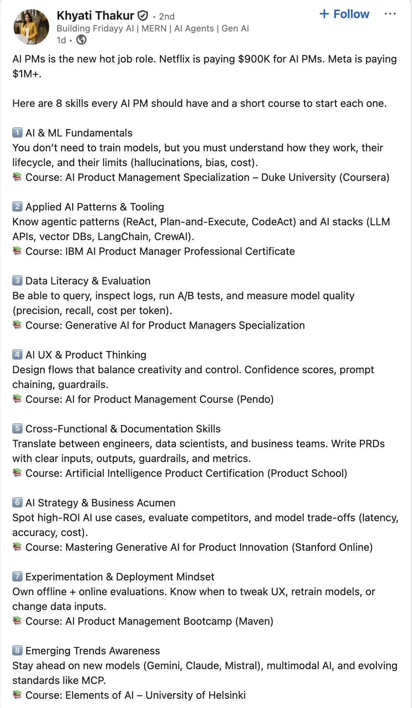
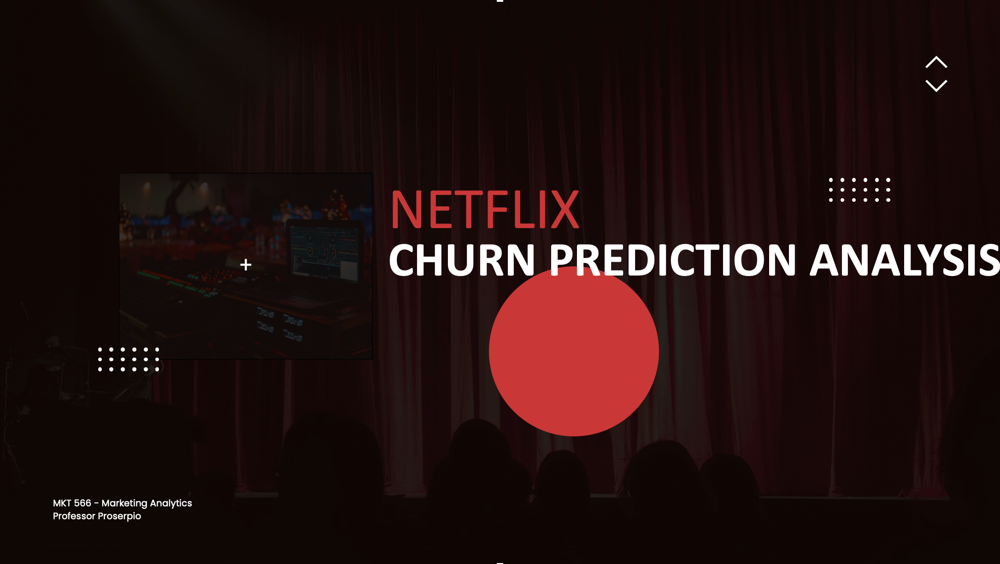

# Introduction {.divider}

## A little about me

- **11th year at USC** (office HOH 332)
- During **2023–25**, worked full-time at **Amazon**, first in Ad Measurement, then in
  Climate Pledge Friendly
  - Worked closely with data scientists, research scientists, sales teams, and product managers
- Currently part-time at **Airbnb** as *Housing Scholar*
- I run the [Real-Estate Analytics Lab (REAL)](http://www.realab.com/) and its free Substack
  with [Marco Giacoletti](https://sites.google.com/nd.edu/marcogiacoletti)

::: {.box}
Personal website: <https://dadepro.github.io/>.
:::

## A little about me {.smaller-90}

Research on **online marketplaces and policy**:

::: {.columns}
::: {.column width="50%"}
- Trust and reputation
- Platform manipulation
- Short-term rentals (Airbnb) and real estate
:::
::: {.column width="50%"}
- Advertising
- Sports betting
:::
:::

[My website](https://dadepro.github.io/) has links to all my papers. They are also on
[SSRN](https://papers.ssrn.com/sol3/cf_dev/AbsByAuth.cfm?per_id=2171934).

## A little about you

- What is your background?
- What do you expect from this class?
- Have you worked in marketing yet?

# The Course {.divider}

## Who to contact

|  | Instructor | Teaching assistant |
|---|---|---|
| **Name** | Davide Proserpio | Raghav Sarmukaddam |
| **Office** | HOH 332 | HOH 311 |
| **Email** | proserpi@marshall.usc.edu | sarmukad@usc.edu |
| **Hours** | Tue 2–4 pm | Thu 2:30–4:30 pm |

: {tbl-colwidths="[16,42,42]"}

Both by appointment as well.

## Organization

**Schedule.** 11:00 am – 12:20 pm, Tuesday and Thursday, in **JKP 202**

**Class website.** <https://github.com/dadepro/mkt566>

**Syllabus.** [mkt566-syllabus-proserpio.pdf](https://raw.githack.com/dadepro/mkt566/main/syllabus/mkt566-syllabus-proserpio.pdf)

::: {.box}
Most lectures involve examples and exercises. Some classes are given over entirely to
exercises, discussion, or guest speakers. 

I am also planning to have a few guest speakers,
very likely from tech companies.
:::

**This class is hands-on.** Bring your laptop and be prepared to analyze data, write code,
and present results.

## Readings {.smaller-90}

Slides, plus open-source reading links provided for each topic.

**Open source**

- [My course on data storytelling](https://github.com/dadepro/mkt-615?tab=readme-ov-file)
- [Data Visualization: A Practical Introduction](https://socviz.co/)
- [R for Data Science](https://r4ds.had.co.nz/)
- [R Markdown](https://rmarkdown.rstudio.com/lesson-1.html)
- [R for Marketing Students](https://bookdown.org/content/6ef13ea6-4e86-4566-b665-ebcd19d45029/)

**Not open source** (slides, exercises, and code are)

- [R for Marketing Analytics](https://r-marketing.r-forge.r-project.org/)
- [Python for Marketing Analytics](https://www.amazon.com/Python-Marketing-Research-Analytics-Schwarz/dp/3030497194)

## Analyzing data and coding

- I will use **R and Python**
  - R primarily for data visualization and statistics
  - Python primarily for machine learning
- For assignments you may use either, but following what I do is easier, especially if
  you are new to coding

**IDE suggestions:** VS Code (pretty much any programming language, integrates with Codex and Claude), RStudio (R only),
Cursor.

## Setup

Before the next class, install:

1. **R and/or Python** (Python ships with macOS):
   [install R/RStudio](https://bookdown.org/content/6ef13ea6-4e86-4566-b665-ebcd19d45029/#download-and-install-r-and-rstudio)
2. **An IDE or editor**
   - RStudio for R
   - [VS Code](https://code.visualstudio.com/download) for essentially any language,
     including R and Python
3. **An AI coding tool**, whichever you prefer:
   [Claude Code](https://code.claude.com/docs/en/vs-code),
   [Codex](https://developers.openai.com/codex/ide), or
   [Cursor](https://cursor.com)

Optional: course materials live on GitHub, so skim
[git - the simple guide](https://rogerdudler.github.io/git-guide/) and the
[GitHub quickstart](https://docs.github.com/en/get-started/start-your-journey/hello-world).

::: {.box-warn}
If this is the **first time** you have heard any of these terms,
raise your hand and ask questions.
:::

## Use of AI (LLMs) {.smaller-90}

I **expect** you to use AI in this class. Learning to use it is an emerging skill. Keep
the following in mind:

- AI is permitted to help you **brainstorm topics** or **revise work you have already written**
- Minimum-effort prompts produce low-quality results. Refining prompts to get good
  outcomes takes work
- Proceed with caution: **do not assume the output is accurate or trustworthy**

::: {.box-warn}
**Hallucinations and mistakes are very common.**
:::

For transparency, every student submits a **log of the LLM prompts** used on each assignment.

## Why this course matters

{fig-align="center" width="62%"}

::: {.smaller-80 .muted}
[Source](https://www.linkedin.com/posts/khyatithakur_ai-productmanagement-genai-activity-7363049531422179328-KcMx)
:::

## Why this course matters

- **Budgets follow measurement**: most marketing spend is now digital and measurable,
  so the marketers who can show what actually works are the ones who win the budget
- **Hiring reflects it**: analytics skills (SQL, R/Python, experiments) appear in a
  growing share of marketing job postings, from brand management to growth roles
  (we will look at the job-postings data on Thursday)
- **AI raises the bar, it does not lower it**: LLMs make code and analysis cheap.
  What stays scarce is judgment: **which question to ask**, **whether the answer is
  credible**, and **what decision follows**

::: {.box}
That judgment is what this course trains: framing marketing questions, picking the
right method, and turning analysis into decisions.
:::

## Grading

| Component | Weight |
|---|---:|
| 4 individual assignments | 60% |
| Semester-long project (groups of 5–6) | 30% |
| Participation | 10% |
| **Total** | **100%** |

: {tbl-colwidths="[70,30]"}

No final exam. Your grade is the weighted average above.

## Assignments

- **4 individual assignments, 60%** of the grade
- Roughly **three weeks** for each

Each submission is an **R (Markdown/Quarto) or Python notebook**, converted to HTML or PDF,
containing:

- Code, properly commented
- Outputs (figures, tables)
- Your answers to the assignment questions
- The **log of LLM prompts** used

::: {.box}
**Why a notebook?** Reproducibility. Someone else, including future you, has to be able to
re-run it and get the same output and results.
:::

# The Semester Project {.divider}

## What it is

Analyze a **real-world dataset** to answer one or more marketing questions. For example:

- **Social media sentiment analysis**: how brand perceptions changed over time, which
  content performs better
- **Customer segmentation**: who are our most valuable segments?
- **Churn prediction and retention**: which users are likely to churn next month?

## An example from last year

{fig-align="center" width="78%"}

## {background-image="images/image6.png" background-size="contain"}

## {background-image="images/image7.png" background-size="contain"}

## {background-image="images/image8.png" background-size="contain"}

## {background-image="images/image9.png" background-size="contain"}

## {background-image="images/image10.png" background-size="contain"}

## Examples from a colleague's class {.smaller-90}

**ChatGPT and online content**

Using Stack Overflow and YouTube data, students found a decline in Stack Overflow activity
for coding topics (Python, Java) alongside an increase in AI-related videos on tech channels.

[Read it](https://tarikajain.substack.com/p/the-ai-disruption-chatgpts-takeover)

## Examples from a colleague's class {.smaller-90}

**Sentiment analysis of Sephora reviews**

Using customer review data, students asked whether reviews help identify which Sephora
products get featured as *trending* on the website.

[Read it](https://medium.com/@chaitanyaparachotill_75259/nveiling-sephoras-beauty-secrets-a-data-driven-approach-to-customer-engagement-e0d06a96aa05)

## Examples from a colleague's class {.smaller-90}

**Breaking box office**

Using Kaggle movie reviews and Box Office Mojo revenues, students documented a **null
result**: customer reviews generally do not explain box office performance, though they may
matter for less popular movies.

[Read it](https://sites.google.com/view/imdb-marketing-analytics-grp6/imdb-review-analysis)

## Examples from a colleague's class {.smaller-90}

**Gender effects in a dating app**

Using Bumble review data, students found that although more users appear to be male, women
rate the app higher than men. A nice application of the `gender-guesser` package.

## Where to find data {.smaller-80}

- **[Kaggle datasets](https://www.kaggle.com/datasets)**, e.g.
  [customer churn](https://www.kaggle.com/datasets/blastchar/telco-customer-churn/data),
  [shopping trends](https://www.kaggle.com/code/iamsouravbanerjee/decoding-customer-shopping-trends),
  [Steam](https://www.kaggle.com/datasets/fronkongames/steam-games-dataset)
- **[Yelp open dataset](https://business.yelp.com/data/resources/open-dataset/)**
- **[Amazon, Google reviews, Steam and more](https://cseweb.ucsd.edu/~jmcauley/datasets.html#amazon_reviews)**
- **[Marketing Science](https://pubsonline.informs.org/journal/mksc)** papers often ship
  data and code for replication
- **Collect it yourself** via an API

::: {.box}
I have data on **Airbnb, TripAdvisor, Expedia, and Yelp**. Ask me if you want it.
:::

## Deliverables and deadlines

| Deliverable | Due |
|---|---|
| Form groups | September 15 |
| Mid-term proposal slides (~15 min incl. Q&A) | October 12 (presented Oct 13, 15) |
| Notebook with cleaning and analysis (HTML or PDF) | December 3 |
| Final presentation slides (~15 min incl. Q&A) | November 30 (presented Dec 1, 3) |
| Peer evaluations | December 15 |

: {tbl-colwidths="[62,38]"}

Do you want me to form the groups, or would you rather do it yourselves?

## Participation

**10% of your grade**, and it is not just coming to class.

- This course is an **active learning experience**: participation is graded on the
  **quality and quantity** of your contributions in each lecture
- I record **attendance** at the beginning of most classes
  - You can miss up to **two sessions** without penalty; more than two will lower
    your participation grade
  - If you miss a class, getting the notes and handouts is your responsibility
- **Course norms count**: be on time, do not leave early, and no phones or other
  off-task devices; violations affect your participation grade

## Read the syllabus

::: {.box-warn}
Everything I have just discussed is in the
[**syllabus**](https://raw.githack.com/dadepro/mkt566/main/syllabus/mkt566-syllabus-proserpio.pdf).
Please **read it at least once**.
:::

# Marketing Analytics {.divider}

## What it is

**Marketing analytics** is the practice of measuring, managing, and analyzing data from
marketing activities to optimize business performance.

It covers:

1. Data collection and integration
2. Visualization and reporting
3. Advanced analysis
4. Defining, measuring, and tracking performance (KPIs)
5. Translating insights into decisions

## 1. Data collection and integration

- **Gathering** information from the web, social media, e-commerce platforms, and elsewhere
- **Unifying** datasets from different sources (online clicks, offline transactions) so
  they can answer a marketing question together

## 2. Visualization and reporting

Creating figures, dashboards, and reports that present insights to stakeholders:

- Advertising effect on sales
- Eco-labeling program growth
- Relationships between variables

## 3. Advanced analysis {.smaller-90}

**Attribution modeling (causality)**

: Which channels or campaigns deserve credit for conversions?

**Recommendation and segmentation (clustering)**

: Group customers by behavior or demographics to tailor messaging; identify products
  consumers are likely to buy; product placement

**Predictive modeling (regression, machine learning)**

: Forecast campaign performance; predict churn; identify fraudulent activity such as fake
  reviews, accounts, and clicks; forecast prices

## 4. KPIs {.smaller-90}

| Metric family | Examples |
|---|---|
| **Acquisition** | Cost per click, cost per acquisition |
| **Engagement** | Click-through rate, time on site |
| **Conversion** | Lead-to-customer rate, average order value |
| **Retention** | Churn rate, customer lifetime value |
| **Incrementality** | How much of the sales lift is *attributable* to the campaign |

: {tbl-colwidths="[30,70]"}

## 5. Translating insights into decisions

Turning analysis into action:

- **Reallocating** budget to top-performing channels
- **Optimizing** messaging and creative
- **Changing** the landing page
- **Identifying** and leveraging new trends
- **Optimizing** prices

## In a nutshell

::: {.box}
By systematically applying statistical methods and data-driven storytelling, marketing
analytics enables organizations to **understand what works**, **identify growth
opportunities**, and **maximize their return on marketing investment**.
:::

# The Course Content {.divider}

## What we will cover

- Data analysis and visualization
- Regressions
- Clustering and recommendations
- Classifiers
- Causality: experiments and observational data
- **LLMs and agents**: new challenges for brands (e.g. search), and how firms are
  leveraging them

## What we will *not* cover {.smaller-90}

- **This is not a programming course.** Learning to code is mostly up to you and your LLM
- **This is not an advanced statistics, econometrics, or ML methods course.** The emphasis
  is on **data-driven decision-making**, so we stay at a high level conceptually

::: {.box}
I assume you are familiar with **basic statistics and probability**. I can post review
slides if that would help.
:::

# Questions? {.divider}
