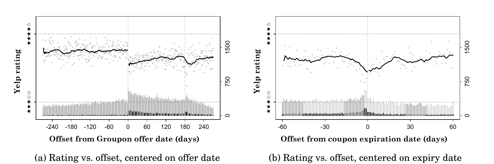

```{r setup}
#| include: false
library(ggplot2)
library(dplyr)
library(forcats)
library(tidyr)
library(treemapify)
library(scales)
library(data.table)
library(ggthemes)
library(patchwork)
library(sf)
library(rnaturalearth)

options(width = 110)
set.seed(566)

# run all chunks from code/, where students work; data lives in code/data/
knitr::opts_knit$set(root.dir = "code")

store.df <- read.csv("code/data/store-sales.csv")
```

# Before We Start {.divider}

## Recap: your toolkit

Everything in this course runs on three pieces from Tuesday's setup guides:

1. **VS Code**: the editor where everything happens
2. **An AI assistant** inside it:
   [Claude Code](https://code.claude.com/docs/en/vs-code),
   [Codex](https://developers.openai.com/codex/ide),
   [Copilot](https://code.visualstudio.com/docs/copilot/overview), or
   [Cursor](https://cursor.com)
3. **R + the R extension**: open a script, run it one line at a time with
   `Cmd+Enter` (Mac) / `Ctrl+Enter` (Windows); charts appear in a VS Code tab

::: {.box}
**Ready check:** open a course script, press `Cmd+Enter` on a chart line, and a
chart appears in a tab. Not there yet? Follow the
[VS Code + AI setup guide](https://raw.githack.com/dadepro/mkt566/main/w1/vscode-setup.html)
and [Running R Code in VS Code](https://raw.githack.com/dadepro/mkt566/main/w1/r-setup.html),
or bring your laptop to office hours.
:::

## Vibecoding: how you will actually write code {.smaller-90}

- **Vibecoding** (Karpathy, 2025): describe what you want in plain English, let
  the AI write the code, run it, look at what comes out, refine, repeat
- Most code in this class (and, increasingly, in industry) gets written this
  way. That changes *which* skills are scarce:
  - **Asking precisely**: "a histogram of weekly sales, 30 bins" beats "make a chart"
  - **Reading results**: does the chart answer the question? Is the number plausible?
  - **Debugging by conversation**: paste the error, ask why, ask for the fix
- What it does not change: **you own everything you submit**, including the
  AI's mistakes

::: {.box}
Today builds the vocabulary this workflow needs: once you know the chart types
by name and what each is for, you can ask for the right one **and judge what
you get back**.
:::

::: {.smaller-80 .muted}
Reminder: every assignment includes a log of your AI use. How? Next slide.
:::

## The AI log: let the AI do the bookkeeping {.smaller-90}

- Every assignment is submitted with an **`ai-log.md`**: a short record of how
  you used AI
- You do not write it. **The assistant does.** Before closing each chat
  session, paste this as your last message:

```
Append a short log of this session to a file called ai-log.md in this folder:
each request I made, one line each, in order, plus anything you got wrong
that we fixed.
```

- Sessions accumulate into one log per assignment; submit the file with your work
- Timing matters: do it **before the chat closes**. A new chat cannot see the
  old conversation

::: {.box}
**Pro move:** save this prompt as a reusable command in your tool (Claude Code:
a *skill*; Codex: a custom prompt; Copilot: a prompt file), so ending a session
with a log takes one keystroke. Ask your assistant how: "create a skill that
appends a session log to ai-log.md when I ask for it."
:::

# Why Visualize? {.divider}

## Why visualize?

::: {.box}
"The simple graph has brought more information to the data analyst's mind than any
other device." — John Tukey
:::

- Summary statistics **hide** as much as they reveal
- A figure is usually the **fastest** way to communicate a result to a stakeholder
- In marketing analytics, most deliverables end life as a chart in someone's deck

## Same numbers, four different stories

```{r anscombe}
#| fig-width: 7.5
#| fig-height: 4.4
ans <- data.frame(
  set = rep(c("I", "II", "III", "IV"), each = 11),
  x   = c(anscombe$x1, anscombe$x2, anscombe$x3, anscombe$x4),
  y   = c(anscombe$y1, anscombe$y2, anscombe$y3, anscombe$y4)
)
ggplot(ans, aes(x, y)) +
  geom_smooth(method = "lm", se = FALSE, color = "firebrick",
              linewidth = .7, fullrange = TRUE) +
  geom_point(size = 2, color = "steelblue") +
  facet_wrap(~set) +
  labs(x = "\nx", y = "y\n") +
  theme_few()
```

::: {.smaller-80 .muted}
Anscombe's quartet: all four datasets share the same means, variances, correlation
(r = 0.82), and regression line (y = 3 + 0.5x). **Always plot your data first.**
:::

## An (almost) perfect example

{fig-align="center" width="62%"}

::: {.smaller-80 .muted}
Source: [*The Groupon Effect on Yelp Ratings: A Root Cause
Analysis*](https://papers.ssrn.com/sol3/papers.cfm?abstract_id=2560825)
(Byers, Mitzenmacher, and Zervas 2012), Figure 1a.
:::

## What we will learn

- What **types of charts** exist and what they are used for
- How to **pick the best visual** for different types of data
- How to create **compelling figures**

We will use **ggplot2**, an R library for data visualization
([intro to ggplot2](https://raw.githack.com/dadepro/mkt-615/main/lectures/07-dataviz/07-dataviz.html#4)).

::: {.smaller-80 .muted}
Content partially based on Chapter 3 of
[R for Data Science](https://r4ds.had.co.nz/data-visualisation.html).
:::

## R scripts for today

Two R scripts on the course website, in the `code/` folder:

1. [**`w1-2-chart-types-class.R`**](https://github.com/dadepro/mkt566/blob/main/w1/code/w1-2-chart-types-class.R):
   reproduces every chart type we discuss today
2. [**`w1-2-data-viz-beautify.R`**](https://github.com/dadepro/mkt566/blob/main/w1/code/w1-2-data-viz-beautify.R):
   a simple figure beautification process

::: {.box}
Download the whole `code/` folder as a zip:
[**`w1-code.zip`**](https://github.com/dadepro/mkt566/raw/main/w1/w1-code.zip)
(it includes the datasets in `data/`), open the scripts in RStudio (or VS Code), and
(try to) install the required libraries. These slides are themselves generated with
Quarto + R: every chart you see is drawn live from those scripts' code.
:::

# Chart Types {.divider}

## A taxonomy

| Family | Question it answers | Charts |
|---|---|---|
| **Category comparison & composition** | How do groups stack up? What makes up the total? | Bar, Pareto, treemap, pie, waterfall |
| **Trends over time** | How do values evolve or accumulate? | Line, area, bar + line combo |
| **Distribution & density** | What is the shape, spread, outliers? | Histogram, density, box, violin |
| **Relationships** | How do variables move together? | Scatter, bubble |
| **Geospatial & matrix** | How do values vary over space or grids? | Choropleth map, heatmap |

: {tbl-colwidths="[30,38,32]"}

## Category comparisons

**Show how discrete groups or items stack up against one another.**

Running example: number of U.S. job postings mentioning each coding skill
(`data/skills-postings.csv`).

```{r skills-data}
df_skills <- read.csv("data/skills-postings.csv")
```

- Bar chart
- Pareto chart (sorted bars + cumulative line)
- Treemap
- Pie chart
- Waterfall chart

## Bar chart

```{r bar-plot}
ggplot(df_skills, aes(x = skill, y = count)) +
  geom_col(fill = "steelblue") +
  labs(title = "U.S. Job Postings by Skill", x = NULL, y = "Number of Postings\n") +
  theme_minimal()
```

## Bar chart: order your bars

```{r bar-plot-reordered}
ggplot(df_skills, aes(x = fct_reorder(skill, -count), y = count)) +
  geom_col(fill = "steelblue") +
  labs(title = "U.S. Job Postings by Skill", x = NULL, y = "Number of Postings\n") +
  theme_minimal()
```

::: {.smaller-80 .muted}
Alphabetical order is an accident; sorted order is a statement. `fct_reorder()` in R.
:::

## Pareto chart

```{r pareto}
df_pareto <- df_skills %>%
  arrange(desc(count)) %>%
  mutate(
    cum_pct = cumsum(count) / sum(count) * 100,
    skill   = fct_reorder(skill, -count)
  )
ggplot(df_pareto, aes(x = skill, y = count)) +
  geom_col(fill = "steelblue") +
  geom_line(aes(y = cum_pct * max(count) / 100, group = 1),
            color = "firebrick", linewidth = 1) +
  geom_point(aes(y = cum_pct * max(count) / 100), color = "firebrick", size = 2) +
  scale_y_continuous(
    name = "Count",
    sec.axis = sec_axis(~ . / max(df_pareto$count) * 100, name = "Cumulative %")
  ) +
  labs(title = "Pareto of Coding-Skill Demand") +
  theme_minimal() +
  coord_cartesian(ylim = c(0, max(df_pareto$count) * 1.05))
```

::: {.smaller-80 .muted}
Sorted bars + cumulative share: identifies the "vital few" driving most of the total.
:::

## The 80/20 rule in marketing

```{r pareto-customers}
customers <- read.csv("data/customer-revenue.csv")
rev <- sort(customers$revenue, decreasing = TRUE)
d <- data.frame(
  pct_customers = (1:500) / 500 * 100,
  pct_revenue   = cumsum(rev) / sum(rev) * 100
)
share20 <- round(d$pct_revenue[d$pct_customers == 20])
ggplot(d, aes(pct_customers, pct_revenue)) +
  geom_line(linewidth = 1, color = "steelblue") +
  geom_segment(aes(x = 20, xend = 20, y = 0, yend = share20), linetype = "dashed") +
  geom_segment(aes(x = 0, xend = 20, y = share20, yend = share20), linetype = "dashed") +
  annotate("text", x = 24, y = share20 - 7, hjust = 0, size = 4,
           label = paste0("Top 20% of customers\n= ", share20, "% of revenue")) +
  labs(title = "Customer Revenue Concentration (simulated)",
       x = "\n% of customers, ranked by revenue", y = "Cumulative % of revenue\n") +
  theme_few()
```

::: {.smaller-80 .muted}
Revenue is almost always concentrated in a small share of customers. This motivates
segmentation, loyalty programs, and CLV analysis (all later in this course).
:::

## Treemap

```{r treemap}
ggplot(df_skills, aes(area = count, fill = skill, label = skill)) +
  geom_treemap() +
  geom_treemap_text(reflow = TRUE, colour = "white") +
  theme_minimal() +
  theme(legend.position = "none")
```

::: {.smaller-80 .muted}
Space-filling overview: area ∝ count. Good for hierarchies (category → brand → SKU).
:::

## Pie chart

```{r pie}
df_pie <- df_skills %>%
  arrange(desc(count)) %>%
  mutate(
    pct = count / sum(count) * 100,
    legend_lbl = paste0(skill, " (", round(pct, 1), "%)")
  )
ggplot(df_pie, aes(x = 1, y = pct, fill = legend_lbl)) +
  geom_col(color = "white", width = 1) +
  coord_polar(theta = "y") +
  theme_void() +
  labs(title = "Market Share of Coding Skills", fill = NULL) +
  theme(legend.position = "right", legend.text = element_text(size = 10))
```

::: {.box-warn}
Use sparingly: humans compare **lengths** far better than **angles**. With more than
3–4 slices, a sorted bar chart is almost always clearer.
:::

## Waterfall chart

```{r waterfall}
df_wf <- df_skills %>%
  arrange(desc(count)) %>%
  mutate(
    cum   = cumsum(count),
    prev  = lag(cum, default = 0),
    type  = "gain",
    skill = factor(skill, levels = skill)
  )
df_wf$idx <- as.numeric(df_wf$skill)
ggplot(df_wf, aes(x = idx)) +
  geom_rect(aes(xmin = idx - 0.4, xmax = idx + 0.4,
                ymin = prev, ymax = cum, fill = type)) +
  geom_text(aes(y = cum + max(cum) * 0.02, label = comma(count)), size = 3) +
  scale_fill_manual(values = c(gain = "forestgreen", loss = "firebrick")) +
  scale_x_continuous(breaks = df_wf$idx, labels = levels(df_wf$skill)) +
  scale_y_continuous(labels = comma, expand = expansion(mult = c(0.02, 0.12))) +
  labs(title = "Waterfall Chart of Coding Skill Demand",
       x = NULL, y = "Cumulative Count", fill = NULL) +
  theme_bw() +
  theme(axis.text.x = element_text(angle = 45, hjust = 1), legend.position = "none")
```

::: {.smaller-80 .muted}
Each bar starts where the previous ended: shows incremental contributions to a total
(common in revenue-bridge and budget decks).
:::

## Trends over time

**Reveal how values evolve or accumulate.**

- Line chart
- Area chart (stacked or cumulative)
- Bar + line combo

## New dataset: store sales

```{r store-head}
#| echo: true
store.df <- read.csv("data/store-sales.csv")
head(store.df)
```

::: {.smaller-80 .muted}
Two years of weekly sales of two products (P1, P2) across 20 stores in 7 countries,
with prices and promotion flags. Sales are in **unit counts**. From Chapman & Feit,
*R for Marketing Research and Analytics*.
:::

```{r weekly}
weekly <- store.df %>%
  group_by(Week) %>%
  summarise(
    TotalP1    = sum(p1sales, na.rm = TRUE),
    AvgP1      = mean(p1sales, na.rm = TRUE),
    AvgP1price = mean(p1price, na.rm = TRUE),
    TotalP2    = sum(p2sales, na.rm = TRUE)
  ) %>%
  arrange(Week) %>%
  mutate(CumTotalP1 = cumsum(TotalP1))
```

## Line chart

```{r line-chart}
ggplot(weekly, aes(x = Week, y = TotalP1)) +
  geom_line(linewidth = 0.8) +
  geom_point(size = 1.5) +
  scale_x_continuous(breaks = seq(1, 52, by = 4)) +
  labs(title = "Weekly Sales of P1", x = "\nWeek of Year", y = "Total P1 Sales\n") +
  theme_bw()
```

## Area chart

```{r area-chart}
weekly_long <- weekly %>%
  select(Week, TotalP1, TotalP2) %>%
  pivot_longer(-Week, names_to = "Series", values_to = "Sales")
ggplot(weekly_long, aes(x = Week, y = Sales, fill = Series)) +
  geom_area(alpha = 0.7) +
  scale_x_continuous(breaks = seq(1, 52, by = 4)) +
  labs(title = "Weekly Sales: P1 vs P2", x = "Week of Year", y = "Sales") +
  theme_minimal() +
  theme(legend.position = "bottom")
```

::: {.smaller-80 .muted}
Stacked areas show composition over time, but only the bottom series sits on a flat
baseline, so read the others with care.
:::

## Bar + line combo

```{r bar-line-combo}
ratio <- max(weekly$AvgP1) / max(weekly$CumTotalP1)
ggplot(weekly, aes(x = Week)) +
  geom_bar(aes(y = AvgP1), stat = "identity", fill = "steelblue") +
  geom_line(aes(y = CumTotalP1 * ratio), color = "firebrick", linewidth = 0.5) +
  geom_point(aes(y = CumTotalP1 * ratio), color = "firebrick", size = 0.5) +
  scale_x_continuous(breaks = seq(1, 52, by = 4), "\nWeek") +
  scale_y_continuous(
    name = "Avg P1 Sale\n", labels = comma,
    sec.axis = sec_axis(~ . / ratio, name = "Cumulative P1 Sales\n",
                        labels = comma, breaks = pretty_breaks(n = 5))
  ) +
  labs(title = "Avg vs. Cumulative P1 Sales by Week") +
  theme_minimal()
```

::: {.smaller-80 .muted}
Two scales on one chart: level (bars, left axis) vs. running total (line, right axis).
:::

## Distribution & density

**Understand the shape, spread, and outliers of a variable.**

- Histogram
- Density plot
- Box plot
- Violin plot

## Histogram

```{r histogram}
ggplot(store.df, aes(x = p1sales)) +
  geom_histogram(bins = 30, fill = "steelblue", color = "white") +
  labs(title = "Histogram of P1 Sales", x = "P1 Sales", y = "Frequency\n") +
  theme_minimal()
```

## Density plot

```{r density}
ggplot(store.df, aes(x = p1sales)) +
  geom_density(fill = "red", alpha = 0.6) +
  labs(title = "Density Estimate of P1 Sales", x = "P1 Sales", y = "Density") +
  theme_minimal()
```

::: {.smaller-80 .muted}
A smoothed histogram: highlights modes, hides bin-choice artifacts.
:::

## Box plot

```{r boxplot}
store.df <- store.df %>%
  mutate(PromoFlag = factor(ifelse(p1prom > 0, "Promoted", "Not Promoted")))
ggplot(store.df, aes(x = PromoFlag, y = p1sales, fill = PromoFlag)) +
  geom_boxplot(alpha = 0.7, outlier.color = "red") +
  scale_fill_manual(values = c("Not Promoted" = "grey70", "Promoted" = "steelblue")) +
  labs(title = "P1 Sales by Promotion Status", x = "", y = "P1 Sales") +
  theme_minimal() +
  theme(legend.position = "none")
```

::: {.smaller-80 .muted}
Median, quartiles, whiskers, outliers: a five-number summary per group.
:::

## Violin plot

```{r violin}
ggplot(store.df, aes(x = PromoFlag, y = p1sales, fill = PromoFlag)) +
  geom_violin(alpha = 0.7, trim = FALSE) +
  geom_boxplot(width = 0.1, outlier.shape = NA, alpha = 0.5) +
  scale_fill_manual(values = c("Not Promoted" = "grey80", "Promoted" = "navy")) +
  labs(title = "Violin Plot of P1 Sales by Promotion Status", x = "", y = "P1 Sales") +
  theme_minimal() +
  theme(legend.position = "none")
```

## Box plot vs violin plot {.smaller-90}

| Aspect | Boxplot | Violin plot |
|---|---|---|
| **What it shows** | Five-number summary (Q1, median, Q3; whiskers; outliers) | Distribution shape (smoothed density) |
| **Outliers** | Explicit points beyond whiskers (1.5×IQR rule) | Not shown by default |
| **Multimodality** | Hard to see | Easy to see (multiple "bulges") |
| **Robustness** | Robust: based on quantiles | Depends on bandwidth and smoothing |
| **Small samples** | Reliable | Can be misleading (noisy density) |
| **When to use** | Compare medians/spread cleanly | Understand shape beyond the median |

: {tbl-colwidths="[22,39,39]"}

## Distributions in the wild: online ratings

```{r ratings-jshape}
ratings <- read.csv("data/online-ratings.csv")
ratings$stars <- factor(ratings$stars)
ggplot(ratings, aes(x = stars)) +
  geom_bar(fill = "steelblue") +
  labs(title = "Distribution of Online Review Ratings (simulated marketplace)",
       x = "\nStar rating", y = "Number of reviews\n") +
  theme_few()
```

::: {.smaller-80 .muted}
Review ratings are typically **J-shaped**: delighted and furious customers review,
the indifferent middle stays silent. The mean rating hides this: plot the
distribution. Much more on reviews and reputation later in the course.
:::

## Relationships & correlation

**Explore how two (or more) variables move together.**

- Scatter plot
- Bubble chart (scatter + size)

## Scatter plot

```{r scatter}
ggplot(store.df, aes(x = p1sales, y = p2sales)) +
  geom_point(alpha = 0.6) +
  labs(x = "Sales of P1", y = "Sales of P2") +
  theme_bw()
```

::: {.smaller-80 .muted}
P1 and P2 sales are negatively associated. What marketing story could explain that?
:::

## Bubble chart

```{r bubble}
ggplot(weekly, aes(x = Week, y = TotalP1, size = AvgP1price)) +
  geom_point() +
  scale_x_continuous(breaks = seq(1, 52, by = 4)) +
  labs(title = "Weekly P1 Sales (size = Avg. Price)",
       x = "Week of Year", y = "Total P1 Sales") +
  theme_minimal() +
  theme(legend.position = "bottom")
```

::: {.smaller-80 .muted}
A third variable mapped to point size: do high-sales weeks coincide with low prices?
:::

## Ad spend and diminishing returns

```{r adspend}
ad <- read.csv("data/ad-spend.csv")
ggplot(ad, aes(spend, sales)) +
  geom_point(alpha = 0.5) +
  geom_smooth(method = "loess", se = FALSE, color = "firebrick") +
  labs(title = "Weekly Ad Spend vs. Incremental Sales (simulated)",
       x = "\nWeekly ad spend ($000)", y = "Incremental sales ($000)\n") +
  theme_few()
```

::: {.smaller-80 .muted}
The response curve is **concave**: doubling spend does not double sales. A scatter
plus a smoother is often the first diagnostic for budget-allocation questions.
:::

## Geospatial & matrix data

**Map values over space or grid layouts.**

- Geospatial map (choropleth, points)
- Heatmap (matrix of values)

## Choropleth map

```{r choropleth}
#| fig-width: 8
#| fig-height: 4.4
p1sales.sum <- store.df %>%
  group_by(country) %>%
  summarise(x = sum(p1sales, na.rm = TRUE)) %>%
  mutate(country = toupper(country))
world <- ne_countries(scale = "medium", returnclass = "sf") %>%
  select(iso_a2, name, geometry)
world_join <- world %>%
  left_join(p1sales.sum, by = c("iso_a2" = "country"))
ggplot(world_join) +
  geom_sf(aes(fill = x), color = NA) +
  scale_fill_gradientn(
    colours = RColorBrewer::brewer.pal(7, "Greens"),
    na.value = "grey90", name = "P1 sales"
  ) +
  labs(title = "Total P1 Sales by Country") +
  coord_sf(expand = FALSE) +
  theme_void() +
  theme(legend.position = "right",
        legend.title = element_text(size = 9),
        legend.text = element_text(size = 8))
```

## Heatmap

```{r heatmap}
store.dt <- as.data.table(store.df)
store.dt[, p1sales_decile := cut(
  p1sales,
  breaks = quantile(p1sales, probs = seq(0, 1, 0.1), na.rm = TRUE),
  include.lowest = TRUE
)]
heatmap_data <- store.dt[, .(count = .N), by = .(storeNum, p1sales_decile)]
ggplot(heatmap_data, aes(x = p1sales_decile, y = factor(storeNum), fill = count)) +
  geom_tile() +
  scale_fill_gradient(low = "white", high = "steelblue", name = "Number of sales") +
  labs(title = "Heatmap of P1 Sales Deciles by Store",
       x = "\nP1 Sales Decile", y = "Store Number") +
  theme_minimal() +
  theme(axis.text.x = element_text(angle = 45, hjust = 1))
```

::: {.smaller-80 .muted}
Two categorical axes + a color-encoded value: spot which stores skew high or low.
:::

## The marketing classic: cohort retention

```{r cohort}
#| fig-width: 8
#| fig-height: 4.4
cohort_df <- read.csv("data/cohort-retention.csv")
ggplot(cohort_df,
       aes(x = months_since,
           y = fct_reorder(cohort, -cohort_month),
           fill = retained_pct)) +
  geom_tile(color = "white") +
  geom_text(aes(label = retained_pct), size = 3) +
  scale_fill_gradient(low = "white", high = "steelblue", name = "% retained") +
  scale_x_continuous(breaks = 0:11) +
  labs(title = "Customer Retention by Acquisition Cohort (simulated)",
       x = "\nMonths since acquisition", y = NULL) +
  theme_minimal()
```

::: {.smaller-80 .muted}
Rows are acquisition cohorts, columns are months since signup: the standard view for
subscription businesses. Are newer cohorts retaining better or worse?
:::

# Choosing the Best Chart {.divider}

## Choosing the best chart

1. **Define your question**: Comparison? Trend? Distribution? Relationship?
2. **Inspect your variables**: categorical vs. numeric; panel vs. cross-section;
   time vs. location vs. hierarchy

For example:

- Price **trends over time** → line chart
- Compare current **job-post counts across languages** → bar chart
- Explore **salary distributions by city** → box or violin plot

# Best Practices {.divider}

## 1. Simplify and declutter

- Reduce "chart junk": eliminate unnecessary gridlines, backgrounds, and 3D effects
  - I often use `theme_few()` in R
- Legends only when needed: if you label directly on the plot, drop the legend;
  don't be redundant

## 2. Readable scales and labels

- **Descriptive titles and subtitles**: tell viewers what they're looking at and why
  it matters
- **Clear axis labels**: include units (e.g., "Sales (USD Millions)") and avoid
  abbreviations when possible
- **Consistent breaks**: choose nice, round numbers or evenly spaced dates
- Always add **figure notes** at the bottom of the figure in documents and reports

## 3. Accessible color and style

- **Color-blind-friendly palettes**: in R, `RColorBrewer` ("Set2", "Dark2") or
  `viridis`
- **Limit colors**: no more than 4–6 distinct colors in a single plot; for many
  categories, consider facets or small multiples instead
- **Transparency** to manage overplotting in dense scatter or area charts
  (the `alpha` parameter in R)

## 4. Leverage facets

- `facet_wrap()` / `facet_grid()` split the data by a categorical variable rather
  than cramming everything into one panel
- Ensures consistent scales and easy side-by-side comparisons

## Grouping: everything in one panel

```{r grouping-example}
ggplot(store.df, aes(x = Week, y = p1sales,
                     group = factor(Year), color = factor(Year))) +
  stat_summary(geom = "line", fun = "mean") +
  scale_color_manual("Year", values = c("blue", "red")) +
  labs(title = "P1 Sales by Year", x = "Week of Year", y = "P1 Sales") +
  theme_bw() +
  theme(legend.position = "top")
```

## Faceting: one panel per group

```{r facet-example}
#| fig-width: 8
#| fig-height: 3.6
ggplot(store.df, aes(x = Week, y = p1sales)) +
  stat_summary(geom = "line", fun = "mean") +
  facet_wrap(~ factor(Year), ncol = 2,
             labeller = labeller(`factor(Year)` = c(`1` = "Year 1", `2` = "Year 2"))) +
  labs(title = "P1 Sales by Year", x = "Week of Year", y = "P1 Sales") +
  theme_bw()
```

## 5. Annotate and highlight key insights

- **Direct labels** with `geom_text()` or `ggrepel` for calling out peaks,
  thresholds, or outliers
- **Annotations** (`annotate()`, `geom_vline()`/`geom_hline()`) to mark events:
  product launches, policy changes, seasonal holidays

```{r annotate-example}
#| fig-height: 3.4
ggplot(weekly, aes(x = Week, y = TotalP1)) +
  geom_line(linewidth = 0.8) +
  geom_vline(xintercept = 26, linetype = "dashed", color = "firebrick") +
  annotate("text", x = 27, y = max(weekly$TotalP1) * 1.035, hjust = 0,
           label = "Campaign launch (illustrative)", color = "firebrick", size = 4) +
  scale_x_continuous(breaks = seq(1, 52, by = 4)) +
  scale_y_continuous(expand = expansion(mult = c(.05, .1))) +
  labs(x = "\nWeek of Year", y = "Total P1 Sales\n") +
  theme_few()
```

## 6. Consistency across plots

- Define a **custom theme** and apply it to every chart so colors, fonts, and
  margins are consistent
- Use the **same color mapping** for the same variables across multiple plots

## 7. Validate and iterate

- **Peer review**: show rough drafts to classmates. Do they "get" the story without
  explanation?
- **Test in grayscale**: verify that patterns and contrasts remain readable when
  printed without color

## How to mislead with a chart

```{r misleading}
#| fig-width: 8.5
#| fig-height: 3.8
d <- data.frame(brand = c("Our brand", "Competitor"), sat = c(82.3, 81.1))
p1 <- ggplot(d, aes(brand, sat, fill = brand)) +
  geom_col(width = .6) +
  coord_cartesian(ylim = c(80.5, 82.6)) +
  scale_fill_manual(values = c("steelblue", "grey70")) +
  labs(title = "What the sales deck shows", x = NULL, y = "Satisfaction (%)") +
  theme_few() + theme(legend.position = "none")
p2 <- ggplot(d, aes(brand, sat, fill = brand)) +
  geom_col(width = .6) +
  coord_cartesian(ylim = c(0, 100)) +
  scale_fill_manual(values = c("steelblue", "grey70")) +
  labs(title = "What the data says", x = NULL, y = "Satisfaction (%)") +
  theme_few() + theme(legend.position = "none")
p1 + p2
```

::: {.box-warn}
Same data, different y-axis. Truncated axes exaggerate differences, a favorite trick
of dashboards and ad claims. When you see a bar chart, **check where the axis starts**.
:::

## Rules are made to be broken

::: {.box}
Break the rules only when doing so tells a **clearer story**. Good visualization is as
much art as science!
:::

# Hands-On: Beautifying a Figure {.divider}

## Our example: price and sales

- A scatterplot is the natural tool to understand the **relationship between two
  variables**
- Let's use it on the most fundamental relationship in marketing, the **demand
  curve**: price (`p1price`) vs. weekly unit sales (`p1sales`) of product 1 in the
  store data

## Step 0: the default plot

```{r beautify-0}
#| echo: true
#| output-location: column
#| fig-width: 5.5
#| fig-height: 4.2
ggplot(data = store.df) +
  geom_point(
    mapping = aes(x = p1price, y = p1sales)
  )
```

## What is wrong with it?

- Axis labels are **not easy to interpret** (what is `p1price`?)
- The **units** in which the variables are measured are unclear
- **Overplotting**: prices take a few discrete values, so points pile up on top of
  each other and hide the density
- Axis **font is very small**, with little space between labels and axis names

Let's fix these issues…

## Step 1: label the axes

```{r beautify-1}
#| echo: true
#| output-location: column
#| code-line-numbers: "5-8"
#| fig-width: 5.5
#| fig-height: 4.2
ggplot(data = store.df) +
  geom_point(
    mapping = aes(x = p1price, y = p1sales)
  ) +
  labs(
    x = "Price of P1 ($)",
    y = "Weekly Sales of P1 (units)"
  )
```

## Step 2: larger fonts, more breathing room

```{r beautify-2}
#| echo: true
#| output-location: column
#| code-line-numbers: "6,7,9-14"
#| fig-width: 5.5
#| fig-height: 4.2
ggplot(data = store.df) +
  geom_point(
    mapping = aes(x = p1price, y = p1sales)
  ) +
  labs(
    x = "\nPrice of P1 ($)",
    y = "Weekly Sales of P1 (units)\n"
  ) +
  theme(
    axis.title.x = element_text(size = 14),
    axis.title.y = element_text(size = 14),
    axis.text.x  = element_text(size = 12),
    axis.text.y  = element_text(size = 12)
  )
```

## Step 3: a cleaner theme

```{r beautify-3}
#| echo: true
#| output-location: column
#| code-line-numbers: "15"
#| fig-width: 5.5
#| fig-height: 4.2
ggplot(data = store.df) +
  geom_point(
    mapping = aes(x = p1price, y = p1sales)
  ) +
  labs(
    x = "\nPrice of P1 ($)",
    y = "Weekly Sales of P1 (units)\n"
  ) +
  theme(
    axis.title.x = element_text(size = 14),
    axis.title.y = element_text(size = 14),
    axis.text.x  = element_text(size = 12),
    axis.text.y  = element_text(size = 12)
  ) +
  theme_few()
```

## Step 4: fix the overplotting

```{r beautify-4}
#| echo: true
#| output-location: column
#| code-line-numbers: "2-5"
#| fig-width: 5.5
#| fig-height: 4.2
ggplot(data = store.df) +
  geom_jitter(
    mapping = aes(x = p1price, y = p1sales),
    width = 0.02, alpha = 0.4
  ) +
  labs(
    x = "\nPrice of P1 ($)",
    y = "Weekly Sales of P1 (units)\n"
  ) +
  theme(
    axis.title.x = element_text(size = 14),
    axis.title.y = element_text(size = 14),
    axis.text.x  = element_text(size = 12),
    axis.text.y  = element_text(size = 12)
  ) +
  theme_few()
```

::: {.smaller-80 .muted}
`geom_jitter()` adds a little horizontal noise; `alpha` makes overlaps visible.
:::

## Step 5: add the trend

```{r beautify-5}
#| echo: true
#| output-location: column
#| code-line-numbers: "16-19"
#| fig-width: 5.5
#| fig-height: 4.2
ggplot(data = store.df) +
  geom_jitter(
    mapping = aes(x = p1price, y = p1sales),
    width = 0.02, alpha = 0.4
  ) +
  labs(
    x = "\nPrice of P1 ($)",
    y = "Weekly Sales of P1 (units)\n"
  ) +
  theme(
    axis.title.x = element_text(size = 14),
    axis.title.y = element_text(size = 14),
    axis.text.x  = element_text(size = 12),
    axis.text.y  = element_text(size = 12)
  ) +
  geom_smooth(
    mapping = aes(x = p1price, y = p1sales),
    method = "lm", color = "blue"
  ) +
  theme_few()
```

## Step 6: add a title

```{r beautify-6}
#| echo: true
#| output-location: column
#| code-line-numbers: "9"
#| fig-width: 5.5
#| fig-height: 4.2
ggplot(data = store.df) +
  geom_jitter(
    mapping = aes(x = p1price, y = p1sales),
    width = 0.02, alpha = 0.4
  ) +
  labs(
    x = "\nPrice of P1 ($)",
    y = "Weekly Sales of P1 (units)\n",
    title = "Weekly P1 Sales Decline with Price"
  ) +
  theme(
    axis.title.x = element_text(size = 14),
    axis.title.y = element_text(size = 14),
    axis.text.x  = element_text(size = 12),
    axis.text.y  = element_text(size = 12)
  ) +
  geom_smooth(
    mapping = aes(x = p1price, y = p1sales),
    method = "lm", color = "blue"
  ) +
  theme_few()
```

::: {.smaller-80 .muted}
A downward-sloping demand curve. How much sales fall when price rises is the **price
elasticity**; we will estimate it with regression in week 4.
:::

## Wrap-up

::: {.box}
Code and data to reproduce today's charts, all on the course website:

- [**`w1-code.zip`**](https://github.com/dadepro/mkt566/raw/main/w1/w1-code.zip):
  one-click download of everything below (scripts + data)
- [**`w1-2-chart-types-class.R`**](https://github.com/dadepro/mkt566/blob/main/w1/code/w1-2-chart-types-class.R):
  every chart type shown today
- [**`w1-2-data-viz-beautify.R`**](https://github.com/dadepro/mkt566/blob/main/w1/code/w1-2-data-viz-beautify.R):
  the beautification walkthrough
- [**`w1-2-simulate-datasets.R`**](https://github.com/dadepro/mkt566/blob/main/w1/code/w1-2-simulate-datasets.R):
  generates the simulated datasets
- [**`data/`**](https://github.com/dadepro/mkt566/tree/main/w1/code/data):
  `store-sales.csv` (real store data) and five small simulated CSVs: customer
  revenue, online ratings, ad spend, cohort retention, job postings
:::

# Questions? {.divider}
