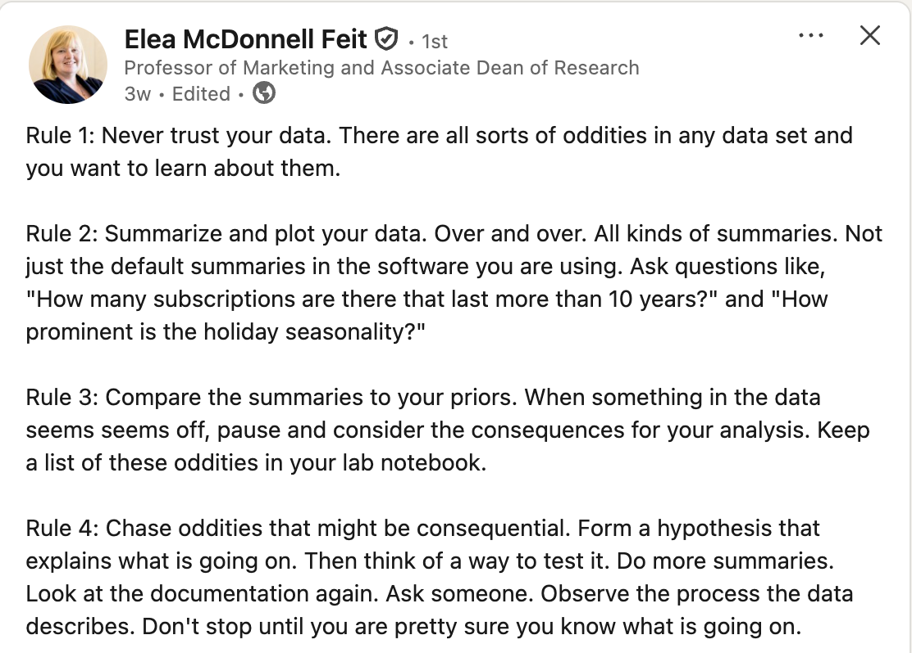

```{r setup}
#| include: false
library(datarium)
library(ggplot2)
library(dplyr)
library(tidyr)
library(data.table)
library(ggthemes)
library(patchwork)

options(width = 110)
set.seed(566)

data("marketing", package = "datarium")
```

# What is EDA? {.divider}

## From charts to questions

- Last week you built the **vocabulary**: which chart types exist, what each is
  for, and how to make a figure worth showing
- This week you put them to work: using charts **systematically** to understand
  a dataset you have never seen before
- That process has a name: **Exploratory Data Analysis** (EDA)

::: {.smaller-80 .muted}
Partially based on Chapter 7 of
[R for Data Science](https://r4ds.had.co.nz/exploratory-data-analysis.html)
(this week's required reading).
:::

## What we will learn

How to use visualization to explore your data in a systematic way:

1. **Generate questions** about your data
2. **Search for answers** by visualizing, transforming, and modeling your data
3. Use what you learn to **refine** your questions and/or generate new ones

## EDA goal

- Develop an **understanding of your data**
- The easiest way to do this is to use **questions as tools** to guide your
  investigation
- EDA is fundamentally a **creative process**

::: {.box}
There is no fixed recipe: the quality of your EDA depends on the quality of the
questions you ask, and each answer suggests the next question.
:::

## Start with summary statistics

Computing summary statistics is also very useful and should be done at the
beginning of any analysis:

- Mean, median
- Standard deviation
- Min, max
- Number of **missing values**

These descriptive statistics can provide valuable insights into your data, and
they are one line of R (`summary()`, as we will see shortly).

## Data cleaning

During EDA you will perform what is called **data cleaning**, which involves
things like:

- Finding and removing **erroneous data** (impossible ages, negative prices,
  duplicated rows)
- Deciding what to do with **outliers**
- Deciding what to do with **missing data**

::: {.smaller-80 .muted}
Rule of thumb: you will spend far more time cleaning than modeling. Budget for
it.
:::

## Feature engineering

Very often you will create new variables from existing ones. This process is
referred to as **feature engineering**, e.g.:

- Extract the **week number** from a date variable
- Sum up **total ad spend** across all advertising channels
- Compute the **cumulative average review rating** for each product

## The EDA workflow

```{mermaid}
%%| fig-width: 12
%%{init: {"themeVariables": {"fontSize": "22px"}, "flowchart": {"nodeSpacing": 35, "rankSpacing": 55, "padding": 12}}}%%
flowchart LR
  A[("Raw<br/>data")] --> B["Initial<br/>EDA"]
  B --> C["Data<br/>cleaning"]
  C --> D[("Cleaned<br/>data")]
  D --> E["Deeper<br/>EDA"]
  E --> F[("Feature-rich<br/>data")]
  F --> G["Final EDA<br/>& viz"]
```

- **Initial EDA**: spot errors, outliers, and missing data → clean them up
- **Deeper EDA**: uncover patterns and group effects, engineer features

::: {.smaller-80 .muted}
The loop matters: what you find in deeper EDA often sends you back to cleaning.
:::

## The rules of EDA

{fig-align="center" height="600"}

## R scripts for this week

In the `code/` folder on the course website:

1. **`w2-1-eda-variation-class.R`**: reproduces every chart in today's deck
2. **`w2-1-simulate-marketing-dataset.R`**: generates the case dataset,
   `data/marketing_eda.csv` (you do not need to run it)

::: {.box}
Download everything as one zip:
[**`w2-code.zip`**](https://github.com/dadepro/mkt566/raw/main/w2/w2-code.zip),
open the scripts in VS Code, and run along.
:::

::: {.smaller-80 .muted}
The in-class case is a separate handout, and it has **no starter code**
on purpose: you will vibecode it. More on the last slides.
:::

# How Do We Explore the Data? {.divider}

## Variation and covariation

- There is **no rule** about which questions you should ask to guide your
  exploration
- However, two types of questions will always be useful for making discoveries
  within your data:

::: {.box}
1. What type of **variation** occurs *within* my variables? *(today)*
2. What type of **covariation** occurs *between* my variables? *(next week)*
:::

## What is variation?

**Variation** is the tendency of the values of a variable to change from
measurement to measurement.

- We are interested in "**within-the-same-variable**" patterns

We can observe variation:

- For the same **continuous** variable over two different measures, e.g.,
  temperature measured at 10 am and 4 pm
- For the same **categorical** variable across different "subjects", e.g., eye
  color across individuals

## How to visualize variation

The best way to understand patterns of variation is to visualize:

1. The **distribution** of the variable's values
2. How the variable **evolves over repeated observations** (e.g., when we have
   repeated observations over time, i.e., panel data or time series)

We will look at both, using two datasets.

## Visualizing distributions

Different charts depending on the type of variable:

| Variable type | Chart |
|---|---|
| **Continuous** (sales, ad spend, prices) | Histogram, density plot |
| **Categorical / discrete** (channel, device, star rating) | Bar chart |

: {tbl-colwidths="[55,45]"}

And for spotting outliers: the **box plot** (coming up).

# Visualizing Distributions {.divider}

## The `marketing` dataset

From the R library **`datarium`**: a marketing experiment with the advertising
budget spent on three channels and the resulting sales.

```{r marketing-head}
#| echo: true
library(datarium)
head(marketing)
nrow(marketing)
```

::: {.smaller-80 .muted}
200 observations. Budgets (`youtube`, `facebook`, `newspaper`) and `sales` are
in thousands of dollars / units.
:::

## Summary statistics first

```{r marketing-summary}
#| echo: true
summary(marketing)
```

::: {.smaller-80 .muted}
One line of R. What do you notice?
:::

## Summary statistics: what they tell us

```{r marketing-summary-2}
summary(marketing)
```

::: {.smaller-90}
- **No missing values** in any column
- `facebook` spend starts at **zero**: some campaigns skip it entirely
- `youtube` gets by far the **largest budgets**
- `sales` vary by a factor of **~17** across campaigns
:::

## Distribution of sales

```{r sales-bw10}
#| echo: true
#| output-location: column
#| code-line-numbers: "3"
#| fig-width: 5.5
#| fig-height: 4.2
ggplot(marketing, aes(x = sales)) +
  geom_histogram(
    binwidth = 10,
    fill = "steelblue", color = "grey20"
  ) +
  labs(title = "Distribution of Sales",
       x = "Sales", y = "Frequency") +
  theme_minimal()
```

::: {.smaller-80 .muted}
`binwidth` controls how wide each bar is: here each bar covers 10 units of
sales.
:::

## Distribution of sales: smaller bins

```{r sales-bw1}
#| echo: true
#| output-location: column
#| code-line-numbers: "3"
#| fig-width: 5.5
#| fig-height: 4.2
ggplot(marketing, aes(x = sales)) +
  geom_histogram(
    binwidth = 1,
    fill = "steelblue", color = "grey20"
  ) +
  labs(title = "Distribution of Sales",
       x = "Sales", y = "Frequency") +
  theme_minimal()
```

## Distribution of sales: too small

```{r sales-bw01}
#| echo: true
#| output-location: column
#| code-line-numbers: "3"
#| fig-width: 5.5
#| fig-height: 4.2
ggplot(marketing, aes(x = sales)) +
  geom_histogram(
    binwidth = 0.1,
    fill = "steelblue", color = "grey20"
  ) +
  labs(title = "Distribution of Sales",
       x = "Sales", y = "Frequency") +
  theme_minimal()
```

## Binwidth: what did we just see?

- `binwidth = 10`: too coarse. Three bars, the shape is hidden
- `binwidth = 1`: the shape appears: most weeks sell 10–20, with a right tail
  of strong weeks
- `binwidth = 0.1`: too fine. Mostly noise

::: {.box-warn}
Bin width is a **choice**, and it changes what you see: too wide hides the
shape, too narrow shows noise. Always try a few values.
:::

## Spend across the three channels

```{r spend-three}
#| fig-width: 11
#| fig-height: 3.6
p_yt <- ggplot(marketing, aes(x = youtube)) +
  geom_histogram(binwidth = 10, fill = "#FF0000", color = "white") +
  labs(title = "YouTube", x = "Spend", y = "Frequency") +
  theme_minimal()
p_fb <- ggplot(marketing, aes(x = facebook)) +
  geom_histogram(binwidth = 5, fill = "#1877F2", color = "white") +
  labs(title = "Facebook", x = "Spend", y = NULL) +
  theme_minimal()
p_np <- ggplot(marketing, aes(x = newspaper)) +
  geom_histogram(binwidth = 5, fill = "grey20", color = "white") +
  labs(title = "Newspaper", x = "Spend", y = NULL) +
  theme_minimal()
p_spend3 <- p_yt + p_fb + p_np
p_spend3
```

::: {.smaller-80 .muted}
Same variable (ad spend), three channels. What do you see?
:::

## Spend across the three channels: three shapes

```{r spend-three-2}
#| fig-width: 11
#| fig-height: 3.6
p_spend3
```

::: {.smaller-90}
- **YouTube**: spread almost uniformly across its range
- **Facebook**: flat-ish, with a mode at low spend
- **Newspaper**: **right-skewed**, a few campaigns spend a lot
:::

## What can we learn from distribution charts?

- **Common vs. rare values**: high vs. low bars
- **Shape**: symmetric or skewed? One mode or several?
- **Unusual patterns**: gaps, spikes, values that should not exist
- **Candidate outliers**: bars far from the rest

The last one deserves its own tool…

# Outliers {.divider}

## How to specifically look for outliers

**Box plots** (or scatter plots) are often more useful than histograms:

- Box plots automatically flag outliers using a mathematical rule
- Any point beyond **1.5 × IQR** (interquartile range):
  - IQR = Quartile 3 − Quartile 1
  - Lower bound = Q1 − 1.5 × IQR
  - Upper bound = Q3 + 1.5 × IQR

::: {.smaller-80 .muted}
Recall from last week: the box is the middle 50% of the data, the line is the
median, the whiskers reach the last point inside the bounds, and dots beyond
them are flagged as outliers.
:::

## Example with ad spend

```{r boxplot}
marketing_long <- data.table(
  pivot_longer(marketing, cols = everything(),
               names_to = "variable", values_to = "value")
)
p_box <- ggplot(marketing_long[variable != "sales"],
       aes(x = variable, y = value, fill = variable)) +
  geom_boxplot() +
  scale_fill_manual(values = c("#1877F2", "grey20", "#FF0000")) +
  labs(title = "Boxplot of Marketing Variables",
       x = "Channel", y = "Ad Spend") +
  theme_minimal() +
  theme(legend.position = "none")
p_box
```

::: {.smaller-80 .muted}
What do you see?
:::

## Example with ad spend: reading it

```{r boxplot-2}
p_box
```

::: {.smaller-90}
- **Newspaper** shows flagged outliers on the high side
- But the three channels live on very **different scales**, so the smaller
  ones are squashed against the axis
:::

## Example with logged ad spend

```{r boxplot-log}
p_boxlog <- ggplot(marketing_long[variable != "sales"],
       aes(x = variable, y = log10(value), fill = variable)) +
  geom_boxplot() +
  scale_fill_manual(values = c("#1877F2", "grey20", "#FF0000")) +
  labs(title = "Boxplot of Marketing Variables (Log Scale)",
       x = "Channel", y = "log Ad Spend") +
  theme_minimal() +
  theme(legend.position = "none")
p_boxlog
```

::: {.smaller-80 .muted}
Same data, log scale. What changed?
:::

## Example with logged ad spend: reading it

```{r boxplot-log-2}
p_boxlog
```

::: {.smaller-90}
- On the log scale the comparison across channels is **fair**
- A different picture appears: now **low-spend** outliers become visible too
:::

## What the log transformation does

**Log makes small values more visible**: it expands small values and
compresses large ones.

When and why to use log:

- To handle **skewed data** (common in marketing: spend, sales, and clicks
  distributions)
- To make patterns at the **low end** visible when a few big values dominate
- To turn **multiplicative growth** into a straight line (e.g., exponential
  trends)

## Why logs matter in EDA {.smaller-90}

- Log makes small values visible: you don't lose them at the bottom of the plot
- It can also reveal **negative outliers** (very low spend, clicks, sales) that
  were hidden on the linear scale
- It emphasizes **relative differences (ratios)** instead of absolute
  differences: $\log(a) - \log(b) = \log(a/b)$

::: {.box}
Example: sales increase from \$100 to \$110

- Actual % change: $\frac{110-100}{100} = 0.10 \rightarrow$ **10%**
- Using logs: $\log(110) - \log(100) = \log(1.1) \approx 0.095 \rightarrow$
  **9.5%**

For small changes, a log difference **is** (approximately) the % change. We
will use this all the time when we get to regression.
:::

## Best practice for outliers

- It's good practice to **repeat your analysis with and without** the outliers
- If they have **minimal effect** on the results, and you can't figure out why
  they're there, it's reasonable to replace them with missing values and move
  on
- If they have a **substantial effect**, you shouldn't drop them without
  justification: figure out what caused them (e.g., a data entry error) and
  **disclose** that you removed them in your write-up
- Generally, rely on **robust statistics** (median over mean, quantiles over
  ranges)

# Visualizing Trends {.divider}

## The `economics` dataset

The second way to visualize variation: how a variable **evolves over time**.
Example with ggplot2's `economics` dataset, monthly US indicators from
[FRED](https://fred.stlouisfed.org/):

```{r economics-head}
#| echo: true
head(economics)
```

::: {.smaller-80 .muted}
`unemploy` is the number of unemployed, in thousands.
:::

## Unemployment over time

```{r trend-line}
#| echo: true
#| output-location: column
#| fig-width: 5.5
#| fig-height: 4.2
ggplot(data = economics) +
  geom_line(
    mapping = aes(x = date, y = unemploy)
  ) +
  labs(title = "Unemployment over time",
       x = "Date",
       y = "Unemployed (thousands)")
```

::: {.smaller-80 .muted}
A line chart is the default for time series. What patterns do you see?
:::

## Long-run direction

```{r trend-lm}
#| echo: true
#| output-location: column
#| code-line-numbers: "8-11"
#| fig-width: 5.5
#| fig-height: 4.2
ggplot(data = economics) +
  geom_line(
    mapping = aes(x = date, y = unemploy)
  ) +
  labs(title = "Unemployment over time",
       x = "Date",
       y = "Unemployed (thousands)") +
  geom_smooth(
    mapping = aes(x = date, y = unemploy),
    method = "lm", color = "blue"
  )
```

::: {.smaller-80 .muted}
A fitted line summarizes the **long-run directional trend**: unemployment
drifts up as the labor force grows.
:::

## Cycles and anomalies

```{r trend-peaks}
#| echo: true
#| output-location: column
#| code-line-numbers: "8-13"
#| fig-width: 5.5
#| fig-height: 4.2
ggplot(data = economics) +
  geom_line(
    mapping = aes(x = date, y = unemploy)
  ) +
  labs(title = "Unemployment over time",
       x = "Date",
       y = "Unemployed (thousands)") +
  geom_vline(
    xintercept = as.Date(c(
      "1975-03-01", "1983-01-01", "1992-08-01",
      "2003-08-01", "2009-11-01")),
    color = "red", linetype = "dashed"
  )
```

::: {.smaller-80 .muted}
Annotating events (here, unemployment peaks after recessions) turns a line
into a story: each spike has a cause.
:::

## What can we learn from trends?

::: {.incremental}
- **Long-run directional trends**: is the series drifting up, down, or flat?
- **Seasonality & cyclicality**: regular patterns that repeat (weekly, yearly,
  business cycles)
- **Anomalies & outliers**: spikes and drops that demand an explanation, often
  the most interesting finding in the data
:::

::: {.box .fragment}
In marketing: sales trends, seasonality in demand, and campaign-driven spikes
are exactly these three patterns. You will look for them in every dataset you
touch.
:::

# The Variation Case {.divider}

## The variation case

In class you will apply all of this to a fresh dataset:
**1,000 customers** of an online retailer, with age, gender, device, ad
channel, ad spend, clicks, purchases, and revenue.

Here is the twist: **there is no starter code**. You will **vibecode** the
whole analysis, exactly as we discussed: you describe the chart, your
AI assistant writes the R, you run it, look, refine, and **you** interpret.

You will answer questions like:

- Is ad spend **symmetric or skewed**, and what marketing strategy could create
  that shape?
- Is the data **balanced across channels**?
- Are there **outliers**, and should we drop them?

## How the case works {.smaller-90}

The handout
([**`w2-1-variation-case.html`**](https://raw.githack.com/dadepro/mkt566/main/w2/w2-1-variation-case.html))
takes the training wheels off gradually:

1. **Tasks 1–2** (look at the data, summary stats): we give you the exact
   prompts to paste
2. **Tasks 3–4**: a prompt skeleton with blanks, then just a hint
3. **Tasks 5–7**: only the goal; the prompt is yours (the last task is a
   question **you** invent)

Deliverables, both made with your assistant: an **R Markdown report knitted
to HTML** with your charts and your written answers (the exact format you
will submit for the homeworks), and your **`ai-log.md`**.


## Wrap-up

::: {.box}
Code and data to reproduce today's charts, all on the course website:

- [**`w2-code.zip`**](https://github.com/dadepro/mkt566/raw/main/w2/w2-code.zip):
  one-click download of everything below
- [**`w2-1-eda-variation-class.R`**](https://github.com/dadepro/mkt566/blob/main/w2/code/w2-1-eda-variation-class.R):
  every chart shown today
- [**`w2-1-simulate-marketing-dataset.R`**](https://github.com/dadepro/mkt566/blob/main/w2/code/w2-1-simulate-marketing-dataset.R):
  generates the case dataset
- [**`data/marketing_eda.csv`**](https://github.com/dadepro/mkt566/blob/main/w2/code/data/marketing_eda.csv):
  the case dataset
- [**The variation case handout**](https://raw.githack.com/dadepro/mkt566/main/w2/w2-1-variation-case.html):
  the in-class vibecoding exercise (bring your laptop!)
:::

::: {.smaller-80 .muted}
Required reading: [Chapter 7 of R for Data
Science](https://r4ds.had.co.nz/exploratory-data-analysis.html). Optional:
Chapters 3–5 of *R for Marketing Research and Analytics*.
:::

# Questions? {.divider}
