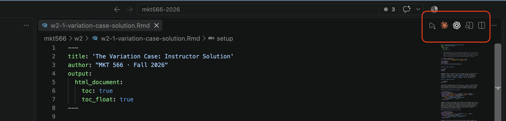

Last week you explored a clean, simulated dataset one variable at a time. This week the data is **real, big, and dirty**: 292,680 beer reviews from [RateBeer](https://www.ratebeer.com/), and the questions are about **covariation**, how variables move together.

Same workflow as the variation case: you describe what you want, the AI writes the R, you run it, look, refine, and **you interpret**. The training wheels come off faster this time: exact prompts for the first task, skeletons for the next two, and from Task 4 on you write every prompt yourself.

The client is a **new craft brewery** deciding which beer styles to brew and how many. Every task builds toward the recommendation you write at the end.

## Two new habits

Some of you said after the variation case that you were not sure you understood what you were doing. Two small additions to the loop fix most of that, and both go in your report:

::: {.callout-note}
## Predict before you run

Before each chart exists, write one sentence: *"I expect ..."* (for example, "I expect IPAs to be the most reviewed style"). Then compare. If the chart disagrees with you, decide: is it the **data** telling you something, or the **code** doing something you did not ask for? A chart you predicted teaches you something either way. A chart you did not predict just looks "fine".
:::

::: {.callout-note}
## Explain it back

After the chart works, pick the **one line** of the AI's code that does the real work (the `geom_`, the `group_by`, the filter) and write in your own words what it does. Stuck? Ask: *"Explain this line as if I have never coded, then quiz me on it."* Then write your own version, not the AI's. If you can explain it, you own it.
:::

Each task below has a spot for both. Keep them short: one or two sentences.

## Setup (5 minutes)

1. Download the dataset: [**`ratebeer-case-data.zip`**](https://github.com/dadepro/mkt566/raw/main/w3/ratebeer-case-data.zip) (5 MB). Unzip it to get `ratebeer.csv` (about 30 MB, 292,680 rows: normal for real data, and R handles it in a second).
2. Make a new folder for today (for example `ratebeer-case`), put `ratebeer.csv` in it, and in VS Code choose **File → Open Folder...** to open that folder.
3. Open your AI assistant panel (Claude Code, Codex, Copilot, or Cursor).
4. Everything else (the R extension, rmarkdown, pandoc) is what you set up for the variation case. If knitting failed for you last week, fix it now, before class, with the [variation case setup steps](https://raw.githack.com/dadepro/mkt566/main/w2/w2-1-variation-case.html#setup-5-minutes) or in office hours.

## The data

One row per **review**. Columns:

| Column | What it is |
|---|---|
| `beer_name`, `beer_beerId` | the beer and its id |
| `beer_brewerId` | the brewery that makes it |
| `beer_style` | the style (IPA, Stout, Pale Lager, ...) |
| `beer_ABV` | alcohol by volume, in percent |
| `review_appearance`, `review_aroma`, `review_palate`, `review_taste` | sub-ratings |
| `review_overall` | the overall rating |
| `review_time` | when the review was posted |
| `review_profileName` | the reviewer |

That is what the columns are *supposed* to contain. Part of your job is finding where reality differs.

## The vibecoding loop, one more time

1. **Ask precisely**: variable, chart type, and specifics (sorted, top 20, log scale, error bars).
2. **Run it** line by line with `Cmd+Enter` / `Ctrl+Enter`.
3. **Look**: does the chart show what you asked for? Are the axes labeled? Is the number plausible?
4. **Refine**: describe what to change, or paste the error message and ask why.
5. **Interpret**: answer the questions in plain English, with the number that supports each claim.

::: {.callout-important}
## The AI log

Before you close each chat, paste the log prompt (the last step of this handout). A new chat cannot see the old one.
:::

## Task 1: look at the data (exact prompt provided)

Paste this into your assistant, exactly as written:

> Create a file called ratebeer-case.R in this folder. It should: load ratebeer.csv with data.table's fread() (the file has about 290,000 rows), show the first few rows, print the number of rows and columns, and print the structure of the table with str(). Also create a folder called figures; we will save charts there. Add a short comment above each step explaining what it does. Do not run it; I will run it myself.

**Predict first:** what does one row represent? A beer, a brewery, or a review? Write it down, then run the file line by line.

**Answer:**

- How many rows and columns? What does one row represent, and why does that matter for counting "how popular is a style" (hint: does a beer with 300 reviews count once or 300 times)?
- Ask the assistant for one more line: the number of **distinct** beers, breweries, and reviewers. How many of each?

**Explain it back:** what does `fread()` do, and why did we use it instead of `read.csv()`?

## Task 2: find the dirt (prompt skeleton)

The `str()` output from Task 1 already hints that something is off. Now look properly. Fill in the blanks:

> Add to ratebeer-case.R: for each of the columns ______, ______, ______, and ______, print the column's type and its 6 most common values with their counts.

Look at `beer_ABV`, `review_overall`, `review_time`, and `beer_style` at least. Then ask for the full list of distinct `beer_style` values and read it.

**Answer, in a short list:** what is wrong with each of these?

- The five `review_` columns: can you compute their mean as they are? Why not?
- `beer_ABV`: what is the `"-"` value? Missing, or zero? Why does the difference matter for an average? (Hint: what would 14,000 zeros do to the mean ABV?)
- `review_time`: what kind of number is that? (Ask the assistant: "what format is 1157587200?")
- `beer_style`: is everything in the list a beer? Are there any names that look garbled?

**Explain it back:** in your own words, what is the difference between a column stored as **text** and one stored as a **number**, and why does R refuse to average text?

## Task 3: clean it (prompt skeleton)

Now that you know what is wrong, tell the assistant exactly what to fix. Fill in the blanks:

> Add a cleaning section to ratebeer-case.R that: (1) converts review_overall, review_aroma, review_appearance, review_palate, and review_taste to numbers by keeping only the number ______ the slash; (2) converts beer_ABV to numeric, treating ______ as missing; (3) creates a new column review_date by converting review_time from ______ to a date; (4) removes rows whose beer_style contains ______ (list every non-beer you found); (5) prints summary() of the cleaned columns, the number of rows left, and the number of missing beer_ABV values.

::: {.callout-tip}
## Check the AI's work

After cleaning, the mean of `review_overall` should be about **13.2** and the maximum **20**. If yours is 0.66, or 1420, the assistant kept the wrong part of `"14/20"`. Paste the summary back and say so. The assistant cannot see your output; you are its eyes.
:::

**Answer:**

- What is the scale of each rating? (Look at the min and max.) Why can't you compare a taste score of 7 to an overall score of 14 directly?
- How many rows did you remove, and how many reviews have a missing ABV? Should those reviews be dropped from the whole analysis, or only from the ABV charts?
- What is the date range of the reviews?

**Explain it back:** pick the line that converts the ratings and explain what it does to the text `"14/20"`.

## Task 4: variation warm-up (you're on your own)

Two charts from last week's toolbox, plus one lookup:

1. An **ordered bar chart** of the number of reviews for the **20 most-reviewed** styles (there are more than 80 styles; all of them would be unreadable). Save it as `figures/reviews-by-style.png`.
2. A **histogram** of `beer_ABV` (`figures/abv-hist.png`).
3. The name, style, and ABV of the beer with the **highest** ABV.

**Predict first:** which style do you expect to be the most reviewed? Roughly what ABV do you expect to be typical?

**Answer:**

- Which styles dominate? Does "most reviewed" mean "most popular", "most produced", or "most interesting to people who write beer reviews"? Which of these matters to our brewery?
- What is the shape of the ABV distribution, and what is the highest-ABV beer? Look it up on the web: is that number a data error or a real product? What does that tell you about outliers in general?

**Explain it back:** what does `reorder()` (or whatever the assistant used) do to the bars?

## Task 5: rating by style (categorical × continuous)

The first covariation question: **which styles do people rate highest?** Ask for a chart of the **average `review_overall` by style, with 95% error bars**, sorted, for styles with at least 500 reviews (`figures/rating-by-style.png`). From Tuesday's lecture: summarize first (one row per style), then chart the summary.

**Predict first:** which style do you expect to be rated highest? Lowest?

**Answer:**

- Which are the three highest- and three lowest-rated styles, and by how much do they differ (on the 20-point scale)?
- Why did we require a minimum number of reviews? What happens to the error bars for the big styles vs. the small ones?
- What do the top styles have in common, and what do the bottom styles have in common? (Look at the ABV column from Task 4. Keep this in mind for the next task.)

**Explain it back:** what is a standard error, in one sentence, and what does `mean ± 1.96 × SE` represent?

## Task 6: rating vs. alcohol (continuous × continuous)

Ask for a **scatter plot** of `review_overall` against `beer_ABV`. Look at it. Then tell the assistant what is wrong with it (Tuesday's lecture has the word for it) and ask for a better version: for example, the **average rating by ABV rounded to the nearest whole percent**, for ABV up to 15%, as a line with points sized by the number of reviews (`figures/rating-vs-abv.png`). Also ask for the correlation between the two.

**Predict first:** do you expect stronger beers to be rated higher, lower, or the same?

**Answer:**

- Describe the relationship in two sentences, with the correlation.
- Does the relationship keep going, or does it flatten? Where?
- Tuesday's warning: does higher alcohol **cause** higher ratings? Give one alternative story (think about *who* reviews a 12% imperial stout, and what else changes with ABV).

**Explain it back:** what does the line that rounds ABV and averages within each value do, and why did it fix the chart?

## Task 7: change the unit of analysis: the brewery

So far every row was a review. The client is a brewery, so let's build a **brewery table**: for each `beer_brewerId`, the number of **distinct styles**, the number of reviews, and the average `review_overall`. Keep breweries with at least 10 reviews. Then ask for a scatter plot of number of styles vs. average rating with a fitted line (`figures/styles-vs-rating.png`), plus the correlation.

**Predict first:** are breweries with many styles rated higher (they are good at everything) or lower (they spread themselves thin)?

**Answer:**

- How many breweries are in the table? What is the typical number of styles?
- What is the relationship between breadth and rating? Is it strong?
- Two alternative explanations for the pattern, other than "brewing more styles makes a brewery better". (Hint: which breweries survive long enough to have many styles?)
- Which is the highest-rated brewery with at least 10 reviews, and the lowest?

**Explain it back:** the line that builds the brewery table (`group_by` + `summarise`, or data.table's `by =`): what does "one row per brewery" mean, and where did the 290,000 reviews go?

## Task 8: over time

Two line charts: the **number of reviews per year** and the **average `review_overall` per year** (`figures/reviews-per-year.png`, `figures/rating-per-year.png`).

**Predict first:** do you expect ratings to rise, fall, or stay flat over a decade?

**Answer:**

- What happens to the number of reviews in the last year? Is beer collapsing, or is something wrong with the data? (Check the date range from Task 3.) Why is this the most common mistake in trend charts?
- Average ratings drift over the decade. Give two explanations that have nothing to do with beer getting better.

**Explain it back:** how did the assistant get a year out of a date?

## Task 9: the recommendation

You are advising the new brewery on **which styles to launch and how many**. Write **three recommendations**, each one sentence plus one supporting number from a chart above (or a new one: for example, whether the share of reviews going to IPAs has grown over the years, or how ratings differ within a style across breweries). Each must name the chart or number it rests on. One of the three must acknowledge a **limitation** of this data for the decision (who writes reviews on RateBeer? what does the data not contain?).

## Deliverable: the knitted report

As in the variation case, and as in every homework:

> Convert ratebeer-case.R into ratebeer-report.Rmd in this folder: an R Markdown report titled "The RateBeer Case", output format html_document. Right under the title, put my first name, last name, and 10-digit USC ID: ______ . One section per task, each containing the code chunk for that task, followed by three placeholders: "**My prediction:**", "**My answer:**", and "**Explain it back:**". Use fread with the file name ratebeer.csv so it knits from this folder.

Fill in the placeholders (the prediction is what you wrote *before* running; do not rewrite it after the fact, a wrong prediction is fine). Preview with the {width=16px style="vertical-align: text-bottom;"} button (`Cmd+Shift+V` / `Ctrl+Shift+V`), then knit with the play button:

No play button, or an error?

> Knit ratebeer-report.Rmd to ratebeer-report.html and tell me if anything fails.

::: {.callout-tip}
Knitting re-runs everything, including loading 290,000 rows and drawing the scatter plot with all of them. If it feels slow, that is normal (under a minute). If it fails on a chunk, paste the whole error into the chat.
:::

Before you close the chat:

> Append a short log of this session to a file called ai-log.md in this folder: each request I made, one line each, in order, plus anything you got wrong that we fixed.

**Submit:** `ratebeer-report.html` and `ai-log.md`, on **Brightspace**, by **Sunday, Sept. 13, 11:59 pm**. In class we aim to finish Tasks 1–6; do the rest at home. Every student submits their own report.

## If something goes wrong

- **"Error: there is no package called 'data.table'".** Paste the error into the chat; the fix is one `install.packages()` line, run once.
- **The assistant says it cannot open the file / the file is too big.** It does not need to read the data. Tell it: "You do not need to open the file. Just write the code; I will run it and paste the output."
- **The summary looks wrong after cleaning** (means near 0 or in the hundreds). The assistant kept the wrong part of `"14/20"`. Paste the summary and say which number is wrong.
- **A chart with 80+ bars or labels nobody can read.** Ask for the top 20, or for labels rotated 45 degrees, or for horizontal bars.
- **The scatter plot is a solid blob.** That is overplotting (Tuesday). Ask for transparency (`alpha`), 2D bins, or an average per ABV value.
- **The last year of a trend chart collapses.** The data ends in January 2012. Say so in the answer, or ask to drop the incomplete year.
- **Knitting fails** mentioning pandoc, or a chunk. Same fixes as the [variation case](https://raw.githack.com/dadepro/mkt566/main/w2/w2-1-variation-case.html#if-something-goes-wrong).
- **The chart opens in a separate window instead of a VS Code tab.** See the troubleshooting section of the [Running R Code guide](https://raw.githack.com/dadepro/mkt566/main/w1/r-setup.html).
