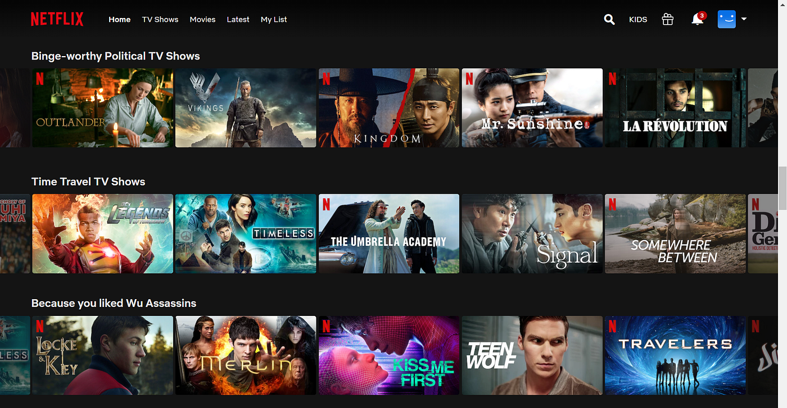
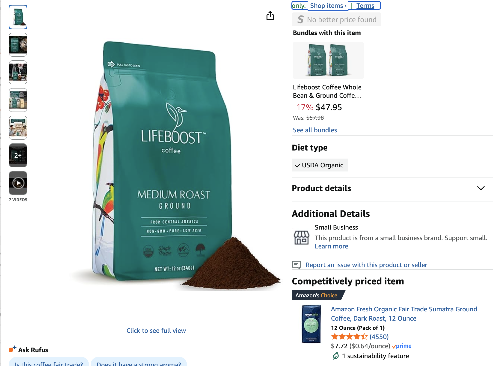
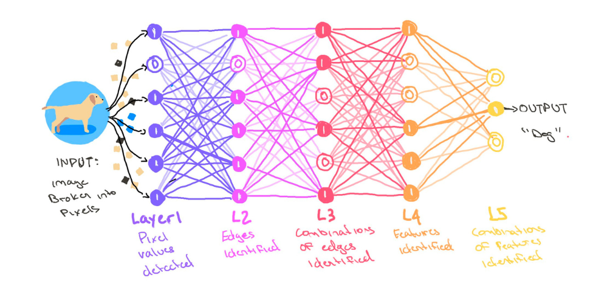
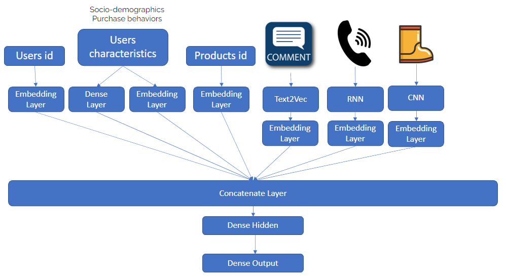

```{r setup}
#| include: false
library(ggplot2)
library(data.table)
library(ggrepel)

# --- MovieLens (small): how empty is a real ratings matrix? ---
ml <- fread("data/movielens/ratings.csv")
ml_ratings <- nrow(ml)
ml_users   <- uniqueN(ml$userId)
ml_movies  <- uniqueN(ml$movieId)
ml_filled  <- 100 * ml_ratings / (ml_users * ml_movies)
per_movie  <- ml[, .N, by = movieId]$N
ml_few     <- 100 * mean(per_movie <= 5)

# --- a made-up two-axis map of movies and one viewer ---
movies_map <- data.table(
  label = c("Crazy, Stupid, Love", "The Notebook", "Mad Max: Fury Road",
            "The Raid", "Bob"),
  x = c(1.35, 1.9, -1.7, -1.5, 1.65),
  y = c(1.05, -1.0, 1.5, -1.3, 1.45),
  type = c(rep("Movie", 4), "Viewer")
)
p_map <- ggplot(movies_map, aes(x, y)) +
  geom_hline(yintercept = 0, color = "grey55") +
  geom_vline(xintercept = 0, color = "grey55") +
  geom_point(aes(color = type, shape = type), size = 5) +
  geom_text_repel(aes(label = label), size = 5.2, box.padding = 0.6,
                  seed = 1, min.segment.length = 10) +
  scale_color_manual(values = c(Movie = "#0072B2", Viewer = "#990000"),
                     name = NULL) +
  scale_shape_manual(values = c(Movie = 16, Viewer = 17), name = NULL) +
  scale_x_continuous(limits = c(-2.4, 2.6), breaks = NULL) +
  scale_y_continuous(limits = c(-2, 2.1), breaks = NULL) +
  labs(x = "Action  ←    →  Romance",
       y = "Budget  ←    →  Premium") +
  theme_minimal(base_size = 16) +
  theme(legend.position = "top", panel.grid = element_blank())
```

# Before We Start {.divider}

## Housekeeping

- **Homework 2** (box office) due **Thursday, Oct. 8**
- **Group project**: proposal presentations on **Oct. 13 and 15**
- Next week: **fall recess**, no class (Oct. 6 and 8)
- Today: **recommendation systems**, then a group discussion on Netflix

## Proposal presentations: how we grade them {.smaller-90}

**Oct. 13 and 15**, 15 minutes per group. Send your slides by **Monday, Oct.
12**. The plan does not need to be finished: this is where you get feedback.

| What we look at | What a good proposal does |
|------|----------------|
| **The question** | says clearly what you want to find out, and why a marketer would care |
| **The data** | says where your data comes from, and shows you can get it |
| **The method** | says how you will answer the question, with at least one tool from this class |
| **The talk** | clear slides, finishes on time, speaks to the room, handles questions well |

::: {.box}
Each of the four parts gets **10, 14, 16, 18, or 25 points**, from "needs
improvement" to "excellent", so the total is out of **100**. The proposal
counts for **15%** of your group project grade.
:::

## Recommendations are everywhere

{fig-align="center" width="80%"}

::: {.smaller-80 .muted}
The Netflix home screen. What is Netflix recommending, and how might it
decide?
:::

## Recommendations are everywhere

{fig-align="center" width="62%"}

::: {.smaller-80 .muted}
An Amazon page for a bag of coffee. On the right, Amazon suggests two
things: a **bundle** of the same coffee, and a cheaper coffee from its **own
brand**. Why would Amazon show you each one? Who benefits, you or Amazon?
:::

## Why recommendations matter for marketing

- Customers **stay longer** when what they see is relevant
- Customers **buy more** when the right product is in front of them
- Customers **come back** when they feel the store "gets" them
- **The risk**: show people only what they already like, and they get stuck
  in a **filter bubble**. They never discover anything new

::: {.box}
Every recommendation is a small marketing decision, made millions of times a
day: **which product do we show this person, right now?**
:::

## Clustering vs. recommendations {.smaller-90}

| | Clustering (Tuesday) | Recommendations |
|---|---|---|
| Goal | put similar customers in groups | guess what one customer will like |
| Result | a group name ("bargain hunters") | a list of products, best first, for each customer |
| Who gets what | everyone in a group gets the same thing | every customer gets their own list |
| Example | a different email for each group | "because you watched..." |

::: {.box}
**Clustering** sorts customers into a few big groups. **Recommendations**
tell *one* customer what to try next.
:::

## Two ways to build a recommender {.smaller-90}

| | Counting | Learning |
|---|---|---|
| Question | which products are bought together? | what will this customer like? |
| Result | rules like "bread → butter" | a score for every product, for every customer |
| Example | "frequently bought together" | "because you watched..." |
| Checked with | support, confidence, lift | how often the list is right; clicks; sales |

::: {.smaller-80 .muted}
We start with counting, which needs nothing but a calculator. Then we move
to learning, which is what people mean by machine learning.
:::

# Counting: What Goes With What {.divider}

## Rules: "people who buy A also buy B" {.smaller-90}

A **rule** reads **A → B**: customers who buy A also tend to buy B. Finding
these rules is called **market basket analysis**.

- The data: one row per **basket** (one shopping trip), one column per
  product: 1 if the product is in the basket, 0 if not
- The method: **count** how often products show up together
- What stores do with the rules:
  - Suggest the second product: "frequently bought together"
  - Put the two products near each other on the shelves
  - Sell them together as a discounted bundle

## Five shopping baskets

| Basket | Bread | Butter | Milk | Beer | Diapers |
|---|---|---|---|---|---|
| 1 | 1 | 1 | 0 | 0 | 0 |
| 2 | 0 | 0 | 1 | 1 | 1 |
| 3 | 1 | 0 | 1 | 0 | 0 |
| 4 | 1 | 1 | 1 | 0 | 0 |
| 5 | 0 | 0 | 0 | 1 | 1 |

::: {.smaller-80 .muted}
1 means the product is in the basket. Which products seem to go together?
How would you measure "together" with a number?
:::

## Three numbers for a rule {.smaller-90}

::::: {.columns}
::: {.column style="width: 36%;"}
| Basket | Bread | Butter |
|---|---|---|
| 1 | 1 | 1 |
| 2 | 0 | 0 |
| 3 | 1 | 0 |
| 4 | 1 | 1 |
| 5 | 0 | 0 |
:::
::: {.column style="width: 59%; margin-left: 5%;"}
Take the rule **bread → butter** and count from the table:

- **Support**: how common is the pair? Baskets with both, out of all
  baskets. Baskets 1 and 4: **2 of 5 = 40%**
- **Confidence**: when someone buys bread, how often do they also buy
  butter? Bread is in baskets 1, 3, and 4; two of those have butter:
  **2 of 3 = 67%**
- **Lift**: how much does buying bread raise the chance of butter?
  Confidence divided by the share of all baskets with butter (2 of 5 =
  40%): **67% ÷ 40% = 1.67**
:::
:::::

::: {.box}
Lift **1.67**: a bread buyer is 1.67 times as likely to buy butter as a
typical shopper. Lift **1**: the two products have nothing to do with each
other. **Below 1**: buying one makes the other *less* likely.
:::

## Your turn: diapers and beer

A store looks at **100 shopping baskets**:

| What is in the basket | Baskets |
|---|---|
| Diapers and beer | 2 |
| Diapers only | 1 |
| Beer only | 38 |
| Neither | 59 |

::: {.smaller-80 .muted}
Compute the support, confidence, and lift of diapers → beer. Would you build
a promotion on it?
:::

## Diapers and beer: the answer {.smaller-90}

| Number | How to get it | Diapers → beer |
|---|---|---|
| Support | baskets with both ÷ all baskets | 2 ÷ 100 = **2%** |
| Confidence | baskets with both ÷ baskets with diapers (2 + 1) | 2 ÷ 3 = **67%** |
| Share with beer | baskets with beer (2 + 38) ÷ all baskets | 40 ÷ 100 = **40%** |
| Lift | confidence ÷ share with beer | 67% ÷ 40% = **1.67** |

- Diaper buyers are 1.67 times as likely to buy beer as a typical shopper.
  That sounds **strong**
- But the support is **2%**: the pattern comes from 2 baskets out of 100.
  Only 3 shoppers bought diapers at all. Too few to trust, and too few to
  be worth a promotion

::: {.box-warn}
Always read the three numbers together. A big lift on a tiny support is a
fun fact, not a strategy. Stores ignore rules below a **minimum support**.
:::

## From rules to recommendations

1. **Count** support, confidence, and lift for every pair of products
2. **Drop** the rules that are too rare or too weak
3. When a customer puts A in the basket, **suggest** B, starting with the
   strongest lift

::: {.box}
This is Amazon's "frequently bought together". It needs only past baskets:
no model, and nothing about the customer. Its limit: it knows what goes
with what, not who *you* are.
:::

# Learning: People Like You {.divider}

## Three approaches

- **Collaborative filtering**: "people like you also liked this". MBA
  students who like R tend to like Python too, so suggest Python
- **Content-based filtering**: "more like what you liked". You liked a
  sci-fi book, so suggest another sci-fi book
- **Hybrid**: most real platforms mix the two

## The core idea: a map of tastes {.smaller-90}

- Put every customer and every product on a **map**, so that similar ones
  sit **close together**
- To recommend, find the products **closest** to the customer
- The computer draws the map from what people watch, click, and buy. Its
  axes capture tastes (genre, price, brand) that nobody had to name
- An **embedding** is the list of numbers that places a customer or a
  product on the map, one number per axis. On the next map, the movie
  *Crazy, Stupid, Love* has the embedding
  (`r movies_map[label == "Crazy, Stupid, Love", x]`,
  `r movies_map[label == "Crazy, Stupid, Love", y]`): toward romance, and
  toward a big budget. Similar embeddings mean similar tastes

::: {.box}
You saw this on Tuesday: **PCA** gave every shopper two coordinates, PC1 and
PC2, and we worked out what the axes meant by reading the arrows. Same idea
here, learned from millions of clicks.
:::

## Movies on a map

```{r movie-map}
#| fig-width: 8
#| fig-height: 4.6
p_map
```

::: {.smaller-80 .muted}
A made-up map with four movies and one viewer, Bob. Which movie would you
recommend to Bob?
:::

## Movies on a map: reading it {.smaller-90}

```{r movie-map-2}
#| fig-width: 8
#| fig-height: 3.3
p_map + theme(legend.position = "none")
```

- **Crazy, Stupid, Love** is closest to Bob: romance, big budget. Recommend
  it first, and the action movies last
- A real system does the same with **hundreds of axes** instead of two, and
  axes nobody has named. The hard part is **drawing the map**

## Collaborative filtering

- Guesses what you will like from what **other people** liked
- The bet: people who agreed in the past will agree again
- It only needs to know **who watched, bought, or rated what**. It knows
  nothing about the movies themselves
- "Collaborative" because everyone's choices help make everyone else's
  recommendations

## Five users, five movies

| User | The Matrix | Titanic | Toy Story | The Godfather | Inception |
|---|---|---|---|---|---|
| 1 | 1 | 0 | 1 | 0 | 1 |
| 2 | 1 | 1 | 0 | 1 | 0 |
| 3 | 0 | 1 | 1 | 0 | 0 |
| 4 | 1 | 0 | 0 | 1 | 1 |
| 5 | 0 | 1 | 0 | 1 | 1 |

::: {.smaller-80 .muted}
1 means the user watched and liked the movie. User 1 has not seen Titanic or
The Godfather. Which one would you recommend to User 1, and why?
:::

## Five users: the answer {.smaller-90}

| User | Movies in common with User 1 | Watched Titanic? | Watched The Godfather? |
|---|---|---|---|
| 2 | 1 (The Matrix) | yes | yes |
| 3 | 1 (Toy Story) | yes | no |
| 4 | **2** (The Matrix, Inception) | no | **yes** |
| 5 | 1 (Inception) | yes | yes |

1. **Compare**: count the movies each user has in common with User 1
2. **Find the closest**: User 4, with 2 movies in common
3. **Recommend** what User 4 liked and User 1 has not seen: **The
   Godfather**

::: {.smaller-80 .muted}
Real systems compare you with thousands of users and use a finer measure of
similarity than a simple count. The logic is the same.
:::

## The catch: cold start {.smaller-90}

Collaborative filtering needs history. No history, no one to compare with.
This is called the **cold start** problem:

- A **new customer** has watched nothing: who is this customer similar to?
- A **new movie** has no viewers yet, so it never gets recommended, so it
  never gets viewers

And most of the table is empty anyway. A real example: **MovieLens**, a
movie-recommendation website run by researchers at the University of
Minnesota, where users rate movies from 0.5 to 5 stars. In its public
sample, **`r ml_users`** users rated **`r format(ml_movies, big.mark = ",")`**
movies:

- Only **`r sprintf("%.1f", ml_filled)`%** of the user-and-movie pairs have
  a rating
- **`r round(ml_few)`%** of the movies have **5 ratings or fewer**

::: {.smaller-80 .muted}
Source: the MovieLens "small" dataset (GroupLens, University of Minnesota),
`r format(ml_ratings, big.mark = ",")` ratings. A new dataset, used only on
this slide.
:::

## Content-based recommenders {.smaller-90}

- Recommend products that **look like** what the customer liked before,
  using what we know about each product: genre, cast, description, price
- Example: you watched a sci-fi thriller, so suggest movies with similar
  descriptions
- **Plus**: a new movie has a description from day one, so it can be
  recommended right away
- **Minus**: the **filter bubble**. Everything looks like what you already
  watched, so you never try anything new

## Which one when? {.smaller-90}

| | Collaborative filtering | Content-based |
|---|---|---|
| Needs | who watched or bought what | a description of each product |
| New product | cannot recommend it | can recommend it right away |
| New customer | cannot recommend | needs a few choices first |
| Good at | surprises: "people like you liked this" | more of the same |
| Risk | popular products win | filter bubble |

::: {.box}
Most platforms use both (**hybrid**): content-based for new products and new
customers, collaborative once there is enough history.
:::

# The Modern Version: Deep Learning {.divider}

## Deep learning, in one picture {.smaller-90}

::::: {.columns}
::: {.column style="width: 42%;"}
- **Deep learning**: computer models built in many **layers**. Each layer
  spots more complex patterns than the one before
- It works with almost any data: pictures, text, sound, clicks, video
- **ChatGPT, Claude, and Gemini** are deep learning models trained on huge
  amounts of text: **large language models (LLMs)**
:::
::: {.column style="width: 53%; margin-left: 5%;"}
{width="100%"}

::: {.smaller-80 .muted}
Recognizing a dog: the first layer sees dots of color, the next sees edges,
later layers see shapes, and the last one says "dog".
:::
:::
:::::

## What deep learning adds {.smaller-90}

{fig-align="center" width="44%"}

::: {.smaller-80 .muted}
You do not need the details: every kind of data goes in at the top, and one
spot on the map comes out at the bottom.
:::

- It draws **much better maps**, because it uses every kind of data: who
  the customer is, what they bought, their reviews, even product photos
- Content-based, the modern way: an LLM reads each movie's plot and cast and
  places the movie on the map

# Does the Recommendation System Work? {.divider}

## Two ways to test a recommender {.smaller-90}

| | Test 1: on past data | Test 2: with real customers |
|----|---------|---------|
| **When** | before any customer sees the new recommendations | after the new recommendations go live on the site |
| **How** | hide last month, let the system guess, compare with what customers really did | give the new system to half the customers and the old one to the other half |
| **What you measure** | precision and recall | clicks, sales, return visits |
| **Why** | cheap and fast: catches a bad system before any customer sees it | the real answer: do customers actually click and buy more? |

::: {.box}
Run test 1 first, because it costs nothing. Run test 2 before you trust the
system, because past data cannot tell you how customers will react to new
suggestions.
:::

## Test 1, on past data: precision and recall {.smaller-90 .nostretch}

Take one customer's history and **hide last month**. The system looks only
at the months before and picks **5 movies** for them. Then we check what the
customer **actually liked** last month:

```{r prec-recall}
#| fig-width: 10
#| fig-height: 2.1
shown <- c("Matrix", "Titanic", "Inception", "Up", "Heat")
liked <- c("Inception", "Heat", "Coco", "Jaws")
tiles <- rbind(data.table(y = 2, x = seq_along(shown), movie = shown),
               data.table(y = 1, x = seq_along(liked), movie = liked))
tiles[, match := movie %in% intersect(shown, liked)]
ggplot(tiles, aes(x, y)) +
  geom_tile(aes(fill = match), width = 0.9, height = 0.72, color = "white") +
  geom_text(aes(label = movie, color = match), size = 5.5, fontface = "bold") +
  annotate("text", x = 0.4, y = c(2, 1), hjust = 1, size = 5.5,
           label = c("We showed (5)", "You liked (4)")) +
  scale_fill_manual(values = c(`TRUE` = "#990000", `FALSE` = "grey88"), guide = "none") +
  scale_color_manual(values = c(`TRUE` = "white", `FALSE` = "grey25"), guide = "none") +
  scale_x_continuous(limits = c(-1.6, 5.6)) +
  theme_void()
```

The **2 matches** (in red) are the movies we showed **and** you liked:

- **Precision** = matches ÷ movies we showed = 2 ÷ 5 = **40%**. Of what we
  showed, how much did you like?
- **Recall** = matches ÷ movies you liked = 2 ÷ 4 = **50%**. Of what you
  liked, how much did we show?

::: {.smaller-80 .muted}
Two more checks: **variety** (does the list cover much of the catalog?) and
**surprise** (does it ever show something less popular that people enjoy?).
:::

## Test 2, with real customers: an A/B test {.smaller-90}

Once the new system is live, split the customers **at random** into two
groups:

- **Group A** (half the customers) keeps the **old** recommendations
- **Group B** (the other half) gets the **new** ones

Then compare the two groups on **clicks** (do they click on what we
recommend?), **sales** (do they buy, book, or stream?), and **return
visits** (do they come back?).

::: {.box}
Example: in group A, 5 of every 100 customers click on a recommendation; in
group B, 8 of every 100 do. The new system raises clicks from 5% to 8%.
Because the split was random, the two groups are alike in everything except
the recommender, so the difference comes from the new system. More on
experiments later in the course.
:::

## Beyond the numbers

- **Fairness**: do small brands and new artists ever get shown, or only the
  big ones?
- **Explanation**: *should* a customer see **why** something was
  recommended ("Because you watched...")? It builds trust, but it also
  shows how much the company knows about them
- **The long run**: do recommendations build loyalty, or just quick clicks?

::: {.box-warn}
Every recommender is built to maximize *something*. Clicks today and loyal
customers next year can pull in different directions. Picking the goal is a
marketing decision, not a technical one.
:::

## In-class assignment: Netflix {.smaller-90}

In small groups, talk about what Netflix's recommender has to get right.
Pick a few questions from each area:

- **The viewer**: something new, or the safe pick? What do you show a
  brand-new subscriber?
- **Filter bubbles**: how far outside your usual taste should Netflix go?
- **The business**: watch time, keeping subscribers, what shows cost.
  Should Netflix push its own shows?
- **The data**: what reveals taste best: finishing a show, rewatching,
  browsing?
- **Ethics and the long run**: privacy, fairness, clicks vs. real
  satisfaction

::: {.box}
Each group shares **one or two things** that surprised you and **one
challenge** you see for Netflix. Full questions:
[assignment sheet](case/recommender-discussion-assigment.pdf).
:::

## Wrap-up

- **Counting**: rules find what is bought together. Read support,
  confidence, and lift **together**
- **Learning**: collaborative filtering (people like you) and content-based
  filtering (more like what you liked). Most platforms mix both
- Both come down to **similarity**: who or what is close to whom on a map of
  tastes
- Test a recommender twice: on past data (precision, recall), then with
  real customers in an A/B test (clicks, sales, return visits). And decide
  what it should aim for

::: {.smaller-80 .muted}
Required reading:
[Netflix's billion-dollar secret](https://www.linkedin.com/pulse/netflixs-billion-dollar-secret-how-recommendation-systems-qin-phd-7zece/)
and
[Marketing automation: recommendation systems](https://medium.com/geekculture/marketing-automation-recommendation-systems-ae39d61aa38).
Optional:
[Two decades of recommender systems at Amazon](https://www.amazon.science/publications/two-decades-of-recommender-systems-at-amazon-com).
Next week: fall recess, no class.
:::

# Questions? {.divider}
